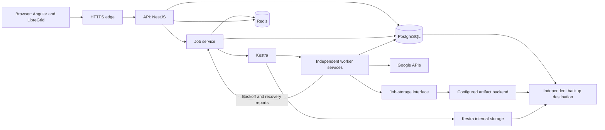

# 03 — Architecture

**Status:** current planning baseline, revised 2026-09-05. See [05](05-decisions-and-open-questions.md) for decision status.

This document integrates the [contractor review](../reviews/2026-09-04-contractor-report.md) and subsequent owner decisions.
The [technical review](../reviews/2026-09-04-technical-change-instructions.md) preserves rationale and detailed change boundaries.
Archived architecture is historical evidence. It does not override this design.
Required experiments remain release gates. Proposed numerical settings do not represent measured support limits.

## Retained stack

| Layer | Technology and responsibility |
|---|---|
| Frontend | Angular, NgRx Signals, Angular Material, Tailwind for layout |
| Grid | AG Grid Community and LibreGrid. The owner authors LibreGrid for the MIT distribution model. |
| API | NestJS and the existing Express adapter. Requests, authorization, queries, previews, job acceptance, and SSE. |
| Workers | Separate worker processes or services. Google requests, parsing, verification, synchronization, and artifact processing. |
| Orchestration | Kestra flows define steps, parallel assignments, scheduling, timeouts, and settlement. |
| Database | PostgreSQL holds entities, permissions, previews, job state, operation evidence, audit, and outbox records. |
| Cache and coordination | Redis holds sessions, browsing selections, caches, broadcasts, and job admission holds. |
| Job storage | Phase 1 supplies the interface, persistent local storage, and one qualified shared backend for distributed workers. |
| Monorepo | Nx, TypeScript contracts, npm, one lockfile, and explicit dependency boundaries |
| Deployment | Compose default, configurable external services, and district-operated Kubernetes profile |

Pin a compatible Angular, Node, TypeScript, AG Grid, and LibreGrid set before implementation.
Angular 22 and PostgreSQL 18 are review candidates. Version qualification remains open.
The [V0 experiments](../validation/v0-2026-09-05/README.md) tested Angular 22.0.8, PostgreSQL 18.6, Redis 8.0.5, and Kestra 1.3.37 in isolation.
Those results do not qualify the existing Compose images or the complete LibreGrid release set.
The grid fixture passed with LibreGrid 1.3.0, AG Grid 36.1.0, and Angular Material/CDK 22.1.5.
Register both LibreGrid's server-side row model and server-side selection modules for the selected grid workflow.
Compiler and browser smoke results do not establish full product interaction or accessibility acceptance.
Apply the [compiler and packaging corrections](../validation/v0-2026-09-05/technical-findings.md) during P0.1/P9.2.
Do not add pg-boss, BullMQ, or Graphile Worker as replacements for Kestra under this decision.
Redis removal and commercial grid replacement are withdrawn recommendations.

## Runtime responsibilities

The job service owns admission, worker observations, Redis hold updates, and terminal cleanup.
It names a logical responsibility. Its deployment placement remains an implementation choice.
Keep bulk execution and worker endpoints outside the interactive API process.
Workers remain independent of browser sessions and API request lifetimes.
Multiple job-service instances require atomic shared transitions and stale-event rejection.

Phase 1 establishes placement, networking, configuration, and startup for all three deployment modes.
Phase 2 supplies application auth, service connections, the shell, and protected diagnostics.
Phase 3 adds Google onboarding, customer settings, and audited delegated platform access.
Phase 4 runs EntityCache synchronization through independent workers and Kestra before the full mutation JobService exists.
Phase 5 adds application mutation acceptance, admission, operation evidence, Jobs UI, and frontend job notifications.
Use the shared runtime contracts across these phases. Do not create a temporary second orchestration engine for cache synchronization.

Kestra flows contain orchestration policy. Worker modules contain domain rules and Google method handling.
Authenticate internal endpoints and restrict network reachability. Do not expose worker, Redis, database, or Kestra ports by default.
Every customer mutation is a job, including one-cell edits and application-requested device commands.
Audit application permission, credential, and configuration changes as security events.

## Google connection and capabilities

Replace the former identity-only OAuth plus DWD combination. It lacks a complete runtime credential exchange.
The candidate default uses district-owned OAuth authorization-code access with actual API scopes and encrypted offline refresh credentials.
Keep application sign-in separate from authorization for background Google API access.
Use a dedicated district-managed Google identity with minimum verified privileges.
Test the default before implementing the wizard. [Google web-server OAuth](https://developers.google.com/identity/protocols/oauth2/web-server)

The connection experiment must demonstrate restart, access-token reuse, renewal, revocation, rotation, and identity replacement.
Configure the correct OAuth audience. Reject External Testing for unattended production with these API scopes.
Validate state, issuer, audience, applicable nonce, and supported authorization-code protections.
Keep encryption keys outside database backups and include protected key recovery in restore procedures.
Credential errors, permission failures, quota backoff, and network failures require distinct diagnostics.

Enterprise credential profiles use a credential-provider interface.
Keyless DWD requires an authenticated source identity, authorized service-account signing, a delegation grant, and an impersonated subject.
An encrypted service-account key remains a fallback where district policy permits it.
Direct service-account roles require endpoint-by-endpoint validation before replacing delegation.
A client ID and secret alone do not supply service-account signing credentials.
See the [Google evidence](../reviews/2026-09-04-google-platform-evidence.md) for sources and unresolved coverage.

Use a district-owned DNS name and browser-trusted HTTPS for shared installations.
Register the exact callback address. Verify browser reachability from the district network.
Remove sslip.io as the production default. Keep localhost exceptions limited to the browser's own host.
Require billing only when an enabled Google service requires it.
Google approval, delegation propagation, and inventory completion remain separate setup stages.

### Capability registry

| Registry field | Required content |
|---|---|
| Identity | Product capability, action version, precise Google method, and supported credential profiles |
| Authorization | Minimum read/write scopes, Google privileges, application permission, and object scope |
| Availability | License, enrollment, reporting policy, device state, and field availability |
| Mutation contract | Writable-field allowlist, validation, preconditions, and conditional-write support or its absence |
| Execution | Ordering, native batch size, HTTP batch support, request cost, retry class, and result semantics |
| Evidence | Primary source, checked date, controlled-account result, and qualified software version |

Generate wizard scope text, diagnostic areas, and action availability from this registry.
There is no fixed eight-scope counter. Read-only setup requests only its required scopes.
Retain `admin.directory.user.security` for enabled sign-out actions and `chrome.management.telemetry.readonly` for telemetry.
Chrome reports, Google external audit, and Drive/Sheets authorization are separate capabilities.
Do not request scopes solely because an opportunity exists in the backlog.

## Customer identity, data, and search

One installation serves one stable Workspace customer ID, including its supported primary, secondary, and alias domains.
Use stable Google IDs for entities. Treat email, serial number, and OU path as searchable attributes.
Store OU parent relationships by ID and membership as explicit group/member edges.
Distinguish direct, external, and nested memberships. Do not imply transitive membership from a direct-member list.

Separate application directory, operation, and security data from Kestra metadata and migrations.
Use SQL-first access through `pg`, typed columns for searched fields, and bounded JSONB for provider metadata and custom fields.
Keep Kestra internals outside domain queries. Budget database pools across every API, worker, and Kestra process.

| Data group | Required content |
|---|---|
| Directory | Stable identities, domains, typed attributes, membership edges, coverage, observation age, and absence state |
| Synchronization | Runs, staging generations, page checkpoints, completeness, leases, and publication |
| Effective reads | Observations plus accepted write overlays, verification state, and conflicts |
| Security | Principals, grants, permission versions, encrypted credential references, and capability health |
| Selection and preview | Owner, filter revision, frozen targets, proposed values, approval, digest, and expiry |
| Execution | Jobs, steps, assignments, operations, attempts, dispatch outbox, and reconciliation |
| Evidence | Audit events, artifacts, exports, baselines, retention, and integrity metadata |
| Notification | Durable outbox, committed replay stream, retention watermark, and consumer recovery |

Define one versioned typed filter expression for grids, saved searches, previews, reports, exports, and optional language translation.
Compile allowlisted fields and operators into parameterized SQL. Apply permission scope to rows, counts, and aggregates.
Candidate limits are depth eight, 100 predicates, 100 default rows, and 500 maximum rows per response.
Validate these settings under the workload suite before making them supported limits.

Rank exact email, alias, serial, asset, and ID matches above prefix matches.
Use selected trigram indexes for descriptive fields and full-text indexes only for identified note-search requirements.
Test Unicode, case, punctuation, repeated names, and numeric-looking identifiers.
PostgreSQL remains the first search implementation. Add another engine only after a measured requirement exceeds it.

Use stable sort keys and cursor pagination. Bind cursors to query, sort, generation, and permission version.
LibreGrid requests numeric row ranges. Adapt those requests with bounded block caches and cursor anchors.
Use bounded offsets for shallow jumps. Materialize ordered IDs or require filtering for unsupported deep jumps.
Ordinary keyset pagination does not provide arbitrary row-number access.
Return rows before expensive counts. Frozen previews require exact counts.

Reports expose their definition, policy thresholds, observation age, coverage gaps, and drill-through entities.
Use one effective read projection for display, filter, sort, count, selection, and export.
Respect district fields controlled by an SIS or another management tool.

## Permissions, selection, and preview

Use grants with principal, capability, action, resource scope, field scope, and constraints.
Provide platform administrator, district operator, school operator, and viewer presets.
Check both source and destination permission for moves. Group access needs an explicit scope rule.
The shared Google identity does not enforce individual application users' school boundaries.

Enforce permission on searches, counts, details, selection, preview, confirmation, dispatch, export, artifacts, audit, and SSE.
Increment the permission version when grants change. Revalidate queued work before dispatch.
Use invitation-only application access, established OIDC libraries, Redis sessions, secure cookies, and CSRF protection.
Define logout, expiry, recovery, credential replacement, and internal service authentication in the first slice.
District policy determines actions requiring a separate approver. Thresholds remain validation settings.

Redis stores compact browsing selections, including original filter, inclusions, exclusions, revision, creator, and scope.
Selections survive page and filter changes under an explicit expiry policy.
Redis expiration must not erase approved targets. Freeze preview and execution manifests durably.

1. Resolve the selection against a pinned data generation and current permissions.
2. Materialize stable target IDs, versions, proposed field values, preconditions, and action version on the server.
3. Count eligible, unchanged, excluded, unauthorized, invalid, and conflicting operations.
4. Publish an immutable preview with a digest and paginated target access.
5. Obtain confirmation and any required independent approval.
6. Revalidate identity, permissions, digest, action version, and expiry.
7. Store the accepted job and dispatch outbox in one PostgreSQL transaction.
8. Return a durable receipt.

A proposed preview expiry is 15 minutes after preparation completes. Qualify the setting before release.
Scheduled jobs retain approved targets. Newly matching entities do not join them automatically.
Use verified provider preconditions where supported. Otherwise document the race between live checks and writes.
Changing targets, values, actor, or action semantics invalidates approval.

## Jobs, steps, assignments, and operations

A job contains steps. A step dispatches bounded assignments to independent workers or services.
Each assignment contains operations with their own durable outcomes. Complete step aggregation after **all assignments settle**.
A settled failure remains a failure. Unresolved remote outcomes remain explicit reconciliation work.
The final job policy defines completion, completion with errors, cancellation, and required review.

Assignment size, active worker count, and Google batch size are separate settings.
The owner's example uses 500 operations per assignment. A 5,000-operation job then contains ten assignments.
Large jobs use as many assignments as needed, with concurrency limited independently.
Do not hardcode 1,000 records or ten workers as architectural constants.

Keep application job identity independent from Kestra execution identity and retention.
Correlate job, execution, step, assignment, operation, and attempt IDs in durable records.
Acceptance and Kestra dispatch do not share a transaction. Reconcile ambiguous trigger responses before creating another execution.

Candidate job states include preparing, awaiting confirmation, approved, queued, running, paused, completed, completed with errors, failed, and cancelled.
Operation states distinguish pending, leased, dispatch recorded, accepted, verifying, succeeded, failed, skipped, unknown, and cancelled.
Finalize transitions and reconciliation ownership in P2.1. Preserve attempt history.

### Dispatch and recovery

1. Claim operations with a lease epoch and bounded expiry.
2. Recheck cancellation, permissions, dependencies, and approved preconditions.
3. Record attempt identity and request intent before contacting Google.
4. Commit intent. Execute the external request outside the database transaction.
5. Classify each operation result, including inner batch responses.
6. Commit results, write overlays, audit events, and notification outbox together.
7. Schedule verification or reconciliation when required.
8. Settle the assignment after its durable outcome commits.

Kestra schedules retries. Workers own per-request randomized backoff.
Retry only eligible unresolved operations. Flow or assignment recovery must skip recorded successes.
One logical operation has one total retry policy across orchestration and request attempts.
HTTP batches do not provide dependency ordering or transactions. Use native bulk endpoints according to their specific limits.

Local idempotency keys prevent duplicate local acceptance. They do not create unsupported Google idempotency guarantees.
The V0 Kestra probe observed duplicate worker requests for both GET and POST dispatch.
Use POST with durable assignment identity, manifest digest checking, and attempt fencing.
Count unique settled assignments from durable records. Do not count HTTP callback deliveries as completed assignments.
A worker can fail after Google accepts a request but before PostgreSQL records success.
Fencing rejects stale local transitions. It cannot cancel a request already sent to Google.
Reconcile dispatched uncertain operations before another unsafe attempt.

| Operation class | Recovery requirement |
|---|---|
| Read | Bounded randomized retry |
| Absolute field update | Recheck relevant current fields and preconditions before repeating |
| Append or prepend | Compute the approved final value once. Never append again during retry. |
| Create | Reconcile stable identity and creation evidence. Existing names do not establish attribution. |
| Membership change | Verify edge state and role conflicts |
| Delete | Verify absence and evidence without claiming attribution from absence alone |
| Sign-out or password action | Apply method-specific replay policy |
| Device command | Persist command ID and track provider lifecycle. Unknown issuance requires reconciliation or review. |

Serialize conflicting operations on an entity, membership edge, or OU structural scope.
Check cancellation before each request and after each result. Preserve successful and uncertain outcomes.
Cancellation stops future dispatch. It does not undo completed Google changes.
Stop new external dispatch when durable intent or audit persistence fails.
After database restore, quarantine uncertain work before enabling mutations.

## Redis job admission after backoff

This section implements the [owner decision](../reviews/2026-09-04-job-admission-policy.md).
Workers execute greedily and report applicable Google backoff to the job service.
Workers do not modify hold keys directly.

The job service writes `HoldDeviceUpdate = job12345` with a **300-second TTL**.
The hold blocks new Update Device jobs. Existing jobs continue their steps, assignments, and retries.
Other job types remain eligible.
Pending jobs of the held type sort smallest to largest. Small arrivals do not bypass the hold or preempt running jobs.

Another active job's accepted backoff report deliberately overwrites the owner and resets the TTL.
Continuing-backoff reports also overwrite ownership and refresh expiration, including during retry waits.
Reporting intervals must be shorter than five minutes. The precise interval remains an implementation setting.
Do not require existing ownership to write or renew a backoff hold.

Completion cleanup atomically deletes only flags still owned by the finishing job.
An earlier owner cannot delete a later owner's hold.
Without accepted refreshes, the hold expires five minutes after its last update.
Do not renew indefinitely from cached worker status after reports cease.

The job service aggregates recovery observations and permits early release after successful calls without backoff.
Five calls is illustrative. The threshold, counted unit, and observation window remain validation settings.
Backoff establishes a new recovery period. A newer throttle invalidates an older success streak.

Proposed safeguards include hold revisions, event deduplication, stale-attempt rejection, and atomic recovery compare-and-delete.
Track a bounded set of each job's hold keys for cleanup. Do not scan every Redis key on each completion.
Cover failed and cancelled executions after their workers settle.
Serialize admission with hold updates through a tested atomic decision.
Keep pending jobs durably in PostgreSQL. Treat Redis queue entries as a rebuildable admission index.
A Redis queue removal and PostgreSQL state update do not form one transaction.
Qualify reservation recovery and conditional durable admission before dispatching through multiple job-service instances.
Use frozen operation count and FIFO ties as proposed ordering details.
Retain configured execution capacity after reopening. Smallest-first ordering does not guarantee starvation freedom.

Do not introduce estimated Google quota balances, fixed budget shares, or a separate quota-management service.
Observe throughput, queue age, backoff, hold duration, and small-job delay.
Use observed throughput for completion estimates, including verification and retries.

## Job-storage interface

Define the interface before worker implementation. Deliver persistent local storage and one qualified shared backend in Phase 1.
Qualify cross-host access before the Phase 1 cluster milestone completes.
Phase 5 extends publication and recovery evidence to actual mutation artifacts.
Preserve file artifacts for every mutation, regardless of size.

| Backend | Access and contract |
|---|---|
| Local filesystem | Persistent volume mounted into participating components on one host |
| Shared filesystem | The same district storage mounted into every worker and artifact consumer |
| S3-compatible object storage | Configured district endpoint and bucket. Workers stream or download inputs and upload results. |

Shared filesystem storage preserves filesystem operations inside its adapter.
Object storage explicitly replaces the filesystem-only transport contract while retaining manifests, result files, and audit evidence.
S3 compatibility does not require Amazon hosting or a new storage cluster in the default installation.

Pass opaque artifact IDs through job and assignment messages.
PostgreSQL metadata resolves backend, locator, checksum, size, schema version, job, attempt, retention, and publication state.
Keep paths and object keys inside adapters. Keep credentials and temporary URLs outside durable job payloads.
Bounded API bodies carry parameters and references. They do not transport entire district datasets.

| Proposed interface operation | Required behavior |
|---|---|
| `stage` | Stream an attempt-specific artifact and return its identity, size, and checksum |
| `inspect` | Verify existence, completed transfer, and integrity evidence |
| `publish` | Application service commits ready metadata and the authoritative reference after verification |
| `openRead` | Authorize and stream a published artifact |
| `remove` | Apply retention or abandoned-upload cleanup after checking active work and references |

Do not require append, filesystem locks, atomic rename, or directory scans in the common interface.
Workers needing file paths materialize inputs in bounded disposable workspace.
Keep authoritative artifacts outside ephemeral container filesystems.

### Publication protocol

1. Allocate a unique artifact ID and record staging intent.
2. Write an immutable artifact for one attempt. Do not let workers append to one shared result file.
3. Complete the write and verify size and checksum.
4. Commit ready state and the job or assignment reference in one PostgreSQL transaction.
5. Let consumers discover published artifacts through metadata and manifests.
6. Reconcile incomplete publication and abandoned writes after crashes.

A filesystem adapter uses temporary files and qualified publication operations, including rename where supported.
An object adapter uploads to a unique immutable key and completes the upload before publication.
The common contract does not assume atomic object rename.
Amazon documents ordinary rename through copy and delete. [S3 object operations](https://docs.aws.amazon.com/AmazonS3/latest/userguide/copy-object.html)
Complete or clean abandoned multipart uploads. [S3 multipart uploads](https://docs.aws.amazon.com/AmazonS3/latest/userguide/mpuoverview.html)
Verify the selected provider. An S3-compatible label does not establish every Amazon behavior.
Use explicit content checksums. Do not assume an ETag equals a content checksum.

Storage writes and database publication do not share a transaction.
Reject stale attempts when attaching results. Protect active uploads and referenced artifacts from cleanup.
Final consolidation collects already durable results. It is not the first audit record.

Configure Kestra internal storage separately from the application interface.
Qualify its storage plugin and all components that consume its files.
A common physical backend is valid only after both integrations pass.

Before changing backends, pause affected dispatch, copy artifacts, verify checksums, and preserve artifact IDs while changing locators.
Test reads and restore before resuming. Retain the previous copy until migration validation completes.

## Synchronization and effective reads

Polling remains the default. Full enumeration supplies reconciliation and deletion evidence.
Use targeted reads after writes and for requested details. Do not invent a universal Google delta token.
Separate schedules for users, devices, groups, memberships, Group Settings, OUs, telemetry, and reports.
Collection age does not substitute for per-object or membership coverage.
Nightly reconciliation remains a scheduling objective subject to measured API cost.
Former hourly group settings and membership guarantees are superseded.

Replace the district-wide Cache Sync lock with collection leases, staging generations, and protected write overlays.
Keep the user-facing name Cache Sync. Full Entity Sync names complete enumeration of the relevant collection.

1. Claim a collection lease and monotonically increasing epoch.
2. Store listing parameters, generation identity, page checkpoints, and coverage.
3. Fetch and stage pages with bounded transactions and worker backoff.
4. Validate completion, authorization coverage, duplicates, and disappearance counts.
5. Reject publication after failed pages, cancellation, or stale lease ownership.
6. Publish a complete generation through a short metadata transaction and notification outbox.
7. Reconcile accepted writes against observations.
8. Retire generations only after readers, previews, exports, and recovery release their references.

Build indexes before publication. Do not rewrite a million-row collection in one transaction under a global job lock.
A completed paginated sweep is not an atomic snapshot of Google's changing account.
Permission loss does not establish deletion. Quarantine unexpected mass disappearance and diagnose coverage.
Targeted, incomplete, failed, and cancelled reads never authorize collection-wide removal.

Store accepted write overlays separately from provider observations.
A stale sweep must not erase a newer accepted write. Retain its overlay until verification or conflict resolution.
Preserve unrelated provider fields. Show accepted-but-unverified values with their state and age.
Apply overlays consistently to display, filters, counts, selection, sorting, and export.
A matching observation establishes state without proving which external actor produced it.

### Notifications

Retain SSE, Redis Pub/Sub, and a durable PostgreSQL outbox.
Commit state and outbox together. Invalidate Redis before broadcasting the corresponding refresh hint.
Deliver only authorized identifiers, event types, and versions. Fetch entity data through the API.
Use one SSE connection per browser tab and preserve drafts and selection during refresh.

Replay through a committed event stream and retention watermark, or issue an explicit resync when replay expires.
A database sequence allocated before commit does not establish commit order.
Test delayed transactions, duplicate broadcasts, disconnections, and current permission checks during replay.
Redis Pub/Sub alone cannot recover missed events. [Redis delivery semantics](https://redis.io/docs/latest/develop/pubsub/)

## Deployment and installation

| Profile | Placement | Storage requirement |
|---|---|---|
| All Docker | Compose: edge, frontend, API, workers, Kestra, PostgreSQL, Redis | Persistent local artifacts and separate backup destination |
| Hybrid Docker and district servers | Same images with per-service external endpoints and retained local components | Shared backend for cross-host artifact consumers |
| Enterprise Kubernetes | Frontend, API, workers, and configured shared services on district-operated Kubernetes | Shared endpoints, qualified artifacts, and separately configured Kestra storage |

[The CC-4 configuration contract](../../deployment/README.md) defines typed settings, profile examples, validation, service placement, and network assumptions.
Its validation establishes configuration consistency. Component versions and runtime qualification remain follow-on work.

Moving a database or adding worker hosts does not require Kubernetes.
Preserve job, permission, and storage contracts across profiles.
Shared services require independent resource, failover, backup, and access-control qualification.

Ship all three profiles in Phase 1. Test every phase's supported workflows against each profile.
Separate minimal component startup in Phase 1 from authenticated application diagnostics in Phase 2.
Use the same image artifacts with profile-specific configuration. Do not maintain separate application implementations for each profile.
Configure storage through an adapter and persistent location. An external object store is not mandatory for the all-Docker profile.

Kestra documents relational-database deployment without full high availability.
Its documented full high-availability architecture requires Enterprise Edition, Kafka, and Elasticsearch.
Retaining Kestra leaves orchestration availability and acceptable recovery time as explicit enterprise gates.
Do not promise full availability from API or worker replicas alone. [Kestra deployment architectures](https://kestra.io/docs/architecture/deployment-architecture)

Ship signed prebuilt images, digests, checksums, an SBOM, a release manifest, and separate development configuration.
The Linux installer checks runtime, architecture, time synchronization, storage, memory, ports, hostname, certificate trust, and egress.
Generate unique secrets and reserve first setup with a temporary bootstrap credential.
Run migrations once. Start services with health checks. Offer sample data or read-only connection.
Configure and test a backup before enabling production writes.

Keep fonts, scripts, styles, and help in the installation bundle.
Runtime Google access requires egress. Document proxies and required destinations.
Use optional district SMTP for email. In-app progress must work without email setup.
Separate local installation progress from Google approval, propagation, and initial inventory.
Trial promotion verifies customer identity, removes sample data, installs production secrets, and invalidates trial approvals.

## Operations, audit, and recovery

Audit acceptance, approval, dispatch, results, cancellation, reconciliation, permissions, credentials, exports, and retention changes.
Record requester, approver, Google identity, authority version, targets, changed fields, and correlated attempt identifiers.
Exclude tokens, passwords, and unnecessary provider payloads.
Preserve permanent logical mutation evidence with searchable archive references.
Temporary transport files do not require permanent retention.

| Data | Proposed default for district review |
|---|---|
| Mutation and security evidence | Permanent logical retention with archive tiers |
| Downloadable results and export baselines | 30 days, or a shorter approved baseline/input policy |
| Operational logs | 14 days with size caps |
| Battery history | 30 daily samples and 24 monthly aggregates |
| Sync staging and execution metadata | Bounded operational retention after recovery and reference checks |

Version and audit retention policies. Display actual artifact expiry.
Restrict audit mutation through separate database roles.
Stronger tamper evidence requires checkpoints or immutable storage under independent administrative control.
A host administrator controlling data, keys, and backups can alter local evidence.

Monitor latency, connection waits, queue age, holds, retries, unknown outcomes, sync coverage, overlay age, archive delay, and backup health.
Correlate request, preview, job, step, assignment, operation, attempt, and generation identifiers.
Provide redacted support bundles without automatic vendor transmission.

| Failure | Behavior |
|---|---|
| Google outage or backoff | Continue local reads with age and coverage. Show queued work and retry state. |
| Revoked credentials | Pause affected capabilities and provide the required reconnect action. |
| PostgreSQL or audit persistence failure | Stop new external dispatch. Reconcile requests already sent. |
| Redis unavailable | Keep approved manifests durable. Pause admission decisions requiring Redis until coordination recovers. |
| Artifact storage unavailable | Block dependent jobs. Keep unrelated reads available. |
| Low disk | Stop work that lacks reserved capacity. Preserve existing evidence and bounded diagnostics. |
| SSE disconnection | Replay or resynchronize without losing drafts or selection. |
| Unavailable live precondition | Block the affected sensitive operation and explain the missing verification. |

Use district-operated PostgreSQL backup tooling or qualify pgBackRest.
Back up application and Kestra data, artifacts, configuration, encryption-key recovery, certificates, and required Redis state.
Document which Redis data restores and which data rebuilds. Admission holds retain their 300-second expiration semantics.
Keep backups outside the production host failure domain. Replication does not replace restore tests.

Restore with mutations disabled. Verify matching database, artifact, and key versions.
Identify the recovery-point gap and reconcile Google effects before releasing safe work.
Quarantine unknown creates, deletes, and commands. Do not automatically run restored unfinished jobs.
Define recovery objectives per profile through [06](06-work-breakdown.md#qualification-workloads-and-targets).

Use expand/contract migrations and a declared rollback window. Pin action versions in queued manifests.
Test upgrade with active jobs and old evidence. Use verified restore or forward repair for irreversible schema changes.
Separate stop, uninstall, and erase-data procedures. Enumerate volumes, bind mounts, keys, backups, and Google credentials during erasure.
Do not claim that volume removal erases every host file or revokes Google access.

## Repository boundaries

Use the existing root-level `frontend/` and `api/` paths. Do not scaffold a second `apps/` tree.
Define worker, contract, domain, database, Google, job, and job-storage modules before implementation.
Shared contracts contain runtime schemas and types without Angular or NestJS dependencies.
Enforce allowed imports through Nx tags and ESLint. Keep npm and one lockfile.
Keep Nx Cloud optional under an explicit metadata policy. Use synthetic district data in CI and screenshots.
See [06](06-work-breakdown.md) for package ownership and validation order.

## Appendix A — Google constraints and validation

These facts inform capability tests. They do not predict hidden quota capacity or burst enforcement.
The [Google evidence note](../reviews/2026-09-04-google-platform-evidence.md) supplies checked sources and unresolved API details.

| Surface | Planning constraint |
|---|---|
| Directory requests | Documented default 2,400 requests/minute per user per project |
| Method limits | User creation: ten per domain per second. OU create/update: one per customer per second. |
| Groups Settings | Documented default 100,000 queries/day. Settings require per-group calls. |
| Chrome Management | Read actual project quotas during the integration experiment. No unlimited-capacity assumption. |
| Directory HTTP batch | Up to 1,000 enclosed calls, each consuming quota. Results require per-operation handling. |
| ChromeOS OU move and status change | Native methods accept up to 50 devices. Do not confuse this with assignment size. |
| Users / ChromeOS / members / telemetry list | Endpoint maxima: 500 / 300 / 200 / 1,000. Verify the ChromeOS documentation discrepancy. |
| Other list surfaces | Verify groups, OUs, Reports, mobile, and future browser APIs before enabling those capabilities. |

Google returns method-specific quota errors, including relevant 403 and 429 responses.
Classify the response reason. Permission denial is not a quota signal.
Use bounded randomized backoff and honor Retry-After when present.
Do not multiply retry budgets through whole-chunk and flow replay.

100,000 requests at the nominal 2,400/minute rate represent 41.7 minutes of budget consumption before additional work.
This arithmetic is not a strict elapsed-time bound. Include reads, competing work, verification, retries, and propagation in observed estimates.
Hourly settings reads for 10,000 groups require 240,000 calls daily before writes.
Membership estimates sum page counts per group, including requests establishing empty groups.

Directory push requires a reachable HTTPS receiver. Polling avoids that inbound dependency.
Telemetry notifications use Google Cloud Pub/Sub, including client-initiated pull delivery.
Keep that integration optional and account for its external service requirements.
Google external audit has source-specific delay and retrieval limits. Verify the supported application window before displaying coverage.
