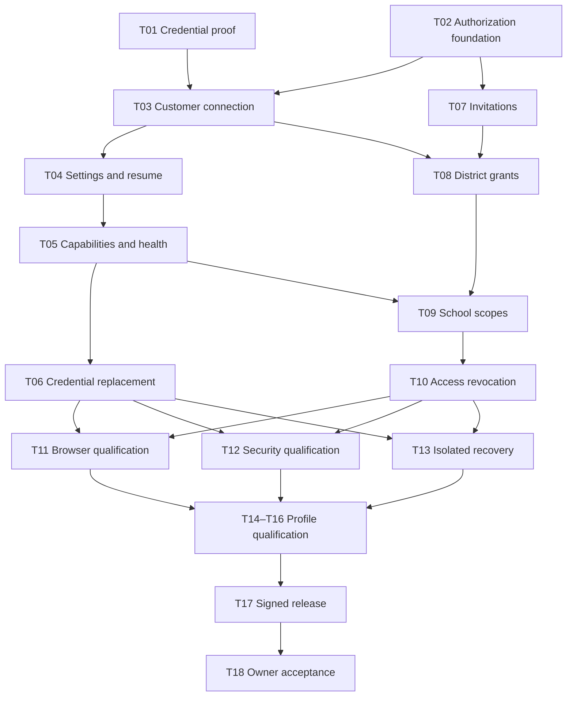

# Phase 3 delivery plan

Plan date: 2026-09-16.
Status: APPROVED by the owner on 2026-09-16. Jira publication and verification are complete. Implementation is active under CC-45.
The [owner acceptance record](../reviews/2026-09-16-phase-2-acceptance.md) closes Phase 2 with its recorded limitations.

## Outcome and completion boundary

A district connects one Google customer account, preserves customer settings, and delegates Campus Commander access.
An authorized operator can resume onboarding, diagnose connection failures, replace credentials, and revoke platform access.
The release preserves those functions after upgrade and isolated restore in all three deployment modes.

This plan implements [Phase 3](06-work-breakdown.md#phase-3--onboarding-customer-settings-and-platform-users).
The [published backlog](phase-3-jira-tasks.md) defines eighteen executable slices and their acceptance criteria.
The [structured manifest](phase-3-jira-tasks.json) records stable planning IDs, dependencies, evidence requirements, and publication state.
Planning IDs remain stable. The manifest maps each planning ID to its verified Jira key.

Completion requires the final acceptance decision and evidence against the selected release revision.
An owner exception must identify the affected criterion, retained limitation, and resulting support boundary.
Phase 1 and Phase 2 stay closed. Their existing qualification limits remain historical facts.

## Baseline and repository findings

The implementation baseline is `7565ff0`, the accepted Phase 2 branch after the closeout documentation commits.
The original workspace snapshot is archival. It is not the Phase 3 implementation base.
[PR 3](https://github.com/CampusCommander/campus-commander/pull/3) remains open against `main` at planning time.

| Existing capability                                                          | Phase 3 treatment                                                                                         |
| ---------------------------------------------------------------------------- | --------------------------------------------------------------------------------------------------------- |
| OIDC login, Redis sessions, CSRF controls, and principal permission versions | Extend the existing authorization path. Preserve logout, expiry, and failure behavior.                    |
| Google web-client JSON import and first-administrator enrollment             | Reuse the accepted installer flow. Do not rebuild CC-39 through CC-41.                                    |
| Fixed identity and Diagnostics permissions                                   | Add explicit grants and scoped checks through a versioned migration.                                      |
| Metadata and deployment configuration allow phases 1 and 2 only              | Add phase 3 consistently across configuration, installer, edge, images, and release validation.           |
| Security events allow a fixed event vocabulary                               | Extend the vocabulary and transactional evidence for configuration, invitations, grants, and credentials. |
| Account, Diagnostics, and shared shell                                       | Add connection, settings, platform-user, and school-scope surfaces using shared controls.                 |
| Installer, signed bundles, upgrades, restores, and fault fixtures            | Extend actual operator commands and extracted-bundle checks for Phase 3 state.                            |
| Google credential proof procedure                                            | Execute the proof against a controlled customer. Phase 2 Google sign-in does not satisfy it.              |

Relevant code boundaries are `libs/application-contracts`, `api/src/app`, `frontend/src/app`, `worker`, and `deployment`.
Migrations belong to the installer. Runtime authorization changes require narrowly granted database operations.
The runtime database role must not gain migration, unrestricted grant-editing, or audit-rewriting authority.

## Scope

Included:

- A qualified district-owned offline OAuth credential profile for enabled read capabilities.
- Stable Google customer identity, primary domains, secondary domains, and alias-domain context.
- Persisted onboarding progress, customer settings, capability consent, and connection health.
- Platform-user invitations, explicit grants, presets, school scopes, and prompt revocation.
- Credential replacement, key recovery, audit evidence, and isolated restore.
- Phase 3 installation, upgrade from the accepted Phase 2 baseline, and release evidence in every profile.

Excluded:

- EntityCache, device inventory pages, background collection, and entity search. These start in Phase 4.
- Google entity mutations, JobService, Jobs, and mutation notifications. These start in Phase 5.
- Managed Google users, OU management, and group management. These retain their later phase boundaries.
- Mandatory SMTP, enterprise DWD implementation, optional AI, and cross-customer aggregation.
- Requalification of every historical Phase 1 or Phase 2 gate as a prerequisite for starting Phase 3.

Phase 3 can read customer, domain, and OU references for connection and permission configuration.
Reference reads do not introduce a managed entity inventory or an OU management page.
Local settings and access changes create security events. They do not require the future Google mutation JobService.

## Stories and source coverage

| Story | Operator outcome                                                            | Phase 3 source item     | Primary slices |
| ----- | --------------------------------------------------------------------------- | ----------------------- | -------------- |
| S01   | Connect with a credential that survives browser closure and service restart | 1                       | T01, T03, T06  |
| S02   | Verify the correct customer account and supported domains                   | 2                       | T03, T05       |
| S03   | Save settings and resume onboarding without losing progress                 | 3                       | T04            |
| S04   | Understand required scopes, approval delays, and capability failures        | 4, 8                    | T01, T04, T05  |
| S05   | Invite a platform user without requiring an email server                    | 5                       | T07            |
| S06   | Assign explicit platform, district, school, and viewer permissions          | 6                       | T02, T08, T09  |
| S07   | Change or revoke access with immediate enforcement and retained evidence    | 5, 7                    | T10, T12       |
| S08   | Replace credentials and restore settings and permissions safely             | 7                       | T06, T13       |
| S09   | Complete the workflows with keyboard, screen reader, and both themes        | Shared release criteria | T11            |
| S10   | Install, upgrade, recover, and accept the working release in every profile  | Shared release criteria | T14–T18        |

All slices include applicable negative cases and evidence. T11 and T12 qualify the combined workflows.
They do not defer basic accessibility or authorization testing until the end.

## Delivery order

| Milestone                                          | Slices                  | Exit evidence                                                                    |
| -------------------------------------------------- | ----------------------- | -------------------------------------------------------------------------------- |
| M0: Prove credentials and preserve existing access | T01, T02                | Controlled-account report and passing Phase 2 compatibility checks               |
| M1: Connect and resume                             | T03, T04, T05           | Customer binding, restart recovery, and truthful capability health               |
| M2: Delegate and recover                           | T06, T07, T08, T09, T10 | Credential replacement, invitations, scoped grants, and cross-replica revocation |
| M3: Qualify complete workflows                     | T11, T12, T13           | Browser, authorization, audit, and isolated recovery evidence                    |
| M4: Ship and accept                                | T14, T15, T16, T17, T18 | Profile reports, signed release, operator results, and acceptance decision       |

T01 and T02 have no internal blockers.
T01 requires controlled-account inputs. T02 can proceed while those inputs remain unavailable.
After T02, invitation and district-grant work can proceed independently from Google connection implementation.
Each profile qualification can proceed after M3. The profiles have no artificial dependencies on each other.

Task sizes describe relative complexity, not delivery promises.
Small means one focused review. Medium means several coordinated implementation and test changes.
Large means a protocol, security, or deployment boundary requiring staged commits.
Assign people and calendar dates after proof inputs and implementation capacity are known.
Record Google approval time separately from engineering effort and operator setup time.

## Contract decisions and proof gates

These proposals make the plan executable. Their owning slices must record final contract decisions before dependent code merges.

| Decision                 | Proposed direction                                                                                                                             | Owner and required evidence                                                                                        |
| ------------------------ | ---------------------------------------------------------------------------------------------------------------------------------------------- | ------------------------------------------------------------------------------------------------------------------ |
| D01: Credential profile  | District-owned offline OAuth. Use an established Google server library and keep login authorization separate.                                  | T01. Prove restart, renewal, revocation, replacement, roles, and required endpoints.                               |
| D02: Capability scope    | Start with customer and domain reads. Add read-only OU references only for an enabled school-scope selector.                                   | T01/T05/T09. Record exact methods, scopes, Google privileges, and observed coverage.                               |
| D03: Credential custody  | Encrypt refresh credentials in PostgreSQL. Store versioned encryption keys outside database backups.                                           | T01/T03/T06/T13. Prove missing-key failure, key rotation, and independent key recovery.                            |
| D04: Customer binding    | Confirm one resolved stable customer ID. Never infer tenancy from an email suffix or silently replace the customer.                            | T03. Prove wrong-customer rejection and concurrent first-connection protection.                                    |
| D05: Invitation identity | Use a single-use invitation and verified OIDC identity. Require inviter confirmation before a previously unknown identity receives grants.     | T02/T07. Prove leaked-link, wrong-identity, replay, expiry, and concurrent redemption denial.                      |
| D06: Grant policy        | Deny by default. Expand named presets into explicit action and resource grants.                                                                | T02/T08. Record a matrix for every Phase 3 API and data surface.                                                   |
| D07: School scopes       | Use district-defined school IDs with explicit stable resource references. Support multiple OU roots without equating a school to one subtree.  | T02/T09. Record include/exclude precedence, overlap, stale references, and synthetic cross-school denial evidence. |
| D08: Privileged changes  | Restrict platform administration and credential management to platform administrators. Prevent removal of the last enabled administrator.      | T02/T08/T10. Verify concurrent changes, self-escalation denial, and operator recovery.                             |
| D09: Durable progress    | Persist business progress in PostgreSQL. Keep expiring authorization transactions in Redis and bind callbacks to their initiating browser.     | T03/T04. Prove restart, Redis loss, stale callbacks, duplicate requests, and concurrent edits.                     |
| D10: Restore             | Preserve customer binding, settings, grants, scope definitions, credentials, and security events. Invalidate sessions and pending invitations. | T13. Require key recovery and connection revalidation before enabling background reads.                            |
| D11: Initial setup mode  | Provide a read-only real connection. Keep any future sample-data mode isolated and outside this phase's release claim.                         | T03/T04. Never request mutation scopes or activate inventory collection.                                           |

Invitations must not grant access solely because someone holds a link or shares the district email suffix.
T07 must settle verified-email use versus explicit issuer/subject confirmation in the accepted invitation contract.
Do not add an email scope to application login without that documented need and corresponding migration tests.
Email delivery remains optional. The operator can copy an invitation link through an existing communication channel.

Phase 3 school tests use controlled references and synthetic resource fixtures.
They prove permission evaluation for the implemented surfaces. They do not claim real inventory row enforcement before Phase 4.
Unknown scope references must never expand access. Derived paths must not replace stable identities.
Group-based scope expansion stays unavailable until its method coverage and membership semantics have evidence.

T01 must classify each historical four-capability proof row against Phase 3's enabled capabilities.
User and device read experiments remain isolated proof work with explicit fixture authorization.
They must not add those scopes to ordinary Phase 3 onboarding or start an inventory subsystem.

## State, security, and recovery design

The following names describe responsibilities. T02 and T03 finalize table and API names through reviewed contracts.

| Durable state                                 | Required invariant                                                                                                     |
| --------------------------------------------- | ---------------------------------------------------------------------------------------------------------------------- |
| Customer binding and domain observations      | One installation, one stable customer ID. Record observation time and validation state.                                |
| Onboarding progress and customer settings     | Store revisions and confirmed steps. Reject stale writes without discarding the user's input.                          |
| Credential generations and encrypted material | Activate replacements atomically. Reject writes from retired generations. Never return secret material to the browser. |
| Capability configuration and health           | Separate enabled, granted, qualified, and currently available. Preserve last successful observation time.              |
| Invitations                                   | Store token hashes, expiry, intended authority, identity confirmation, and terminal state. Redemption is atomic.       |
| Permission grants and school definitions      | Persist explicit actions, stable resource scopes, constraints, and permission versions.                                |
| Security events                               | Commit state changes and evidence together. Retain actor, target, time, correlation, and sanitized change categories.  |

Preserve historical migrations and checksums. Add forward migrations with upgrade and retry evidence.
Migrate existing principals without silently broadening their access.
The installation operator must explicitly confirm which existing principal receives the Phase 3 platform-administrator preset.
Retain existing identity and Diagnostics access during that transition.
Test restoration from the preceding backup instead of assuming destructive schema rollback.

Credential consumers use a single provider contract across API checks and independent workers.
The callback stores only a validated candidate credential before customer confirmation.
Use bounded cleanup for abandoned authorization attempts and unconfirmed candidate credentials.
The provider reuses valid access tokens and coordinates renewal across replicas.
Version checks prevent a late refresh response from overwriting a replacement credential.
Do not put tokens in Kestra variables, job payloads, URLs, logs, or public evidence.

Google connection failure must not prevent local application sign-in or installer health checks.
Distinguish missing authorization, missing privileges, missing scopes, policy restrictions, quota, and network failure.
Use bounded retries only for classified transient failures. Revoked credentials require an operator action.
Separate unavailable Google services from invalid local grants and unavailable PostgreSQL or Redis.

Every protected request must evaluate the current principal and permission version.
Every state change must recheck authority within its transaction and write its security event atomically.
Concurrent revocation must prevent later authorized effects under a stale grant version.
Redis failure must not create a local authorization fallback.
Lists, counts, details, diagnostics, and security-event views require the same scope policy as write endpoints.

## UI work

Use [the repository UI contract](../ui/README.md). Routine implementation does not require Figma parsing.

| Surface            | Primary task                                                    | Rules and pattern                                             |
| ------------------ | --------------------------------------------------------------- | ------------------------------------------------------------- |
| Connection setup   | Authorize and verify the installed customer                     | UI-01 through UI-10, FORM-01                                  |
| Customer settings  | Edit permitted installation settings and see saved revisions    | UI-01 through UI-10, FORM-01                                  |
| Google Diagnostics | Understand capability state and perform a bounded recheck       | UI-01 through UI-10, FORM-01                                  |
| Platform users     | Invite a person and manage explicit application access          | UI-01 through UI-10, FORM-01                                  |
| School scopes      | Review district scope definitions and stable reference mappings | UI-01 through UI-10, FORM-01, TREE-01 when using an OU picker |
| Shared shell       | Show customer context and truthful connection health            | UI-01, UI-02, UI-04, UI-06, UI-08, UI-09, UI-10               |

Record applicable rules rather than claiming every rule passed without evidence.
UI-07 applies to confirmation, consequences, and permission changes. Google entity mutation controls remain unavailable.
Each surface needs loading, empty, error, partial, stale, and offline behavior or a documented inapplicable state.
Separate Google approval, capability verification, and local completion. Do not display false inventory progress in Phase 3.
Preserve input after permission changes or service errors. Explain the action required for recovery.
Use the current token file and shared Material controls for both themes.

## Validation plan

| Area                | Required proof                                                                                                                   | Slice owners        |
| ------------------- | -------------------------------------------------------------------------------------------------------------------------------- | ------------------- |
| OAuth protocol      | Exact callback, state, supported code protections, consent denial, replay, partial scope grant, and token omission               | T01, T03            |
| Customer boundary   | Correct customer, primary/secondary/alias domains, wrong-customer rejection, and concurrent connection                           | T01, T03            |
| Background access   | Browser closure, API/worker restart, token reuse, renewal races, retired credentials, and missing keys                           | T01, T03, T06       |
| Progress            | Reload, Redis loss, service restart, stale writes, duplicate callback, and interrupted configuration                             | T04                 |
| Health              | Privilege denial, scope denial, revoked token, quota, network error, and bounded recovery                                        | T05                 |
| Invitations         | Intended identity, link leakage, hash storage, expiry, revocation, replay, race, and optional email delivery                     | T07                 |
| Grants              | Every preset, least privilege, self-escalation denial, last-administrator protection, and permission migration                   | T02, T08            |
| School boundary     | Overlapping scopes, excluded resources, stale references, path changes, counts, and guessed identifiers                          | T09                 |
| Revocation          | Active browser, two API replicas, queued checks, stale forms, concurrent writes, and direct API requests                         | T10                 |
| Audit and redaction | Atomic state/event persistence, audit-write failure, constrained database roles, and secret-free support output                  | T12                 |
| Accessibility       | Both themes, keyboard, focus, reader announcements, contrast, targets, zoom, and long labels                                     | Every UI slice, T11 |
| Recovery            | Distinct restore target, recovered keys, revoked old sessions, expired invitations, preserved grants, and exact customer binding | T13                 |
| Profile lifecycle   | Clean install, repeated resume, Phase 2 upgrade, isolated restore, faults, and operator commands                                 | T14–T16             |
| Release identity    | Exact commit, image digests, signatures, inventory, SBOM, dependency scans, and evidence hashes                                  | T17                 |
| Operator acceptance | Prescribed release, observed workflows, defects, accepted exceptions, and final decision                                         | T18                 |

Use a deterministic Google simulator for repeatable faults and concurrency.
Use controlled real Google accounts for protocol, privileges, domain coverage, and unattended credential proof.
Use real PostgreSQL and Redis for migrations, transaction failures, session checks, and concurrent permission changes.
Keep live credentials and customer data outside the repository. Publish sanitized outcomes and fixture aliases only.

Existing Nx targets include `api-e2e:auth-integration`, `api-e2e:auth-image-integration`, and `api-e2e:screen-reader-integration`.
The deployment project has installer, release, profile, PostgreSQL, Redis, operations, and qualification checks.
Existing profile targets cover all-Docker, hybrid CLI, Kubernetes, upgrade, restore, process faults, capacity, and certificates.
Extend these checks for Phase 3. Add dedicated credential and permission targets only with their owning implementation slice.
Do not describe a proposed target as an existing command.

Before each implementation check, inspect the resolved project targets through `npm exec nx show project <project> -- --json`.
Run affected build, lint, test, and type checks against the actual PR base.
Run the owning protocol or browser integration whenever the change alters its behavior.
Routine changes use focused feedback. A selected release revision requires the complete Phase 3 qualification matrix.

Every evidence record must identify the source revision, image digests, environment, command, result, duration, and limitations.
Record `not-run` for missing evidence. Separate synthetic profile qualification from district infrastructure acceptance.
Retain evidence for each distinct release revision. Do not reuse earlier results without an explicit applicability record.

## Release and operations

T14–T16 each produce installation, resume, upgrade, restore, and fault evidence from the actual delivered installer.
These slices can prepare signed candidate artifacts for qualification before T17 publishes the final release inventory.
Run against extracted, independently verified bundles. Preserve original manifests and bind reports to exact image content.
Use a pinned accepted Phase 2 artifact as the upgrade source and record its exact digest.
Include administrators, ordinary platform users, school grants, invitations, settings, credentials, and security events in upgrade fixtures.

Hybrid qualification must state worker-host placement, TLS services, storage, and observed recovery limits.
Kubernetes qualification must state replica placement, egress enforcement, secret projection, storage behavior, and cluster limits.
Record DNS and provider endpoint changes as operational concerns. Do not require unrestricted provider egress by default.
Stop, uninstall, update, resume, and explicit erasure must preserve their existing operator contracts.
Credential erasure and revocation procedures must cover encrypted credentials, independent keys, backups, and pending authorization transactions.

T17 publishes signed images, a manifest, checksums, SBOMs, scans, and an evidence inventory.
Publication must distinguish laboratory, profile-qualified, and accepted release states.
T18 records the owner's decision against that exact release and completes the epic only after reconciling every criterion.
No released claim can exceed its recorded test environment or accepted support boundary.

## Git workflow

1. Base this planning branch on accepted Phase 2 commit `7565ff0`.
2. Keep the archival snapshot branch outside the delivery history.
3. Open the planning PR against `implementation/phase-2-cc-22` while PR 3 remains open.
4. After PR 3 merges, update the planning branch and retarget its PR to `main`.
5. Review the resulting diff and rerun document checks after any merge or squash changes ancestry.
6. Publish the approved Jira mapping in a follow-up commit on the planning PR.
7. Use `codex/cc-<key>-<short-purpose>` branches for implementation slices.
8. Keep each slice independently reviewable and link its Jira issue in the PR title and body.
9. Use explicit stacked PR bases only for unfinished dependencies. Retarget them when their dependencies merge.
10. Record behavior, migration effects, checks, UI rules, evidence, and remaining limits in each PR.
11. Close the Jira task after its merged change satisfies the acceptance criteria.
12. Tag only the selected release revision after the required release checks pass.

Do not merge the planning PR or Phase 2 PR solely because this document exists.
User acceptance of Phase 2 remains recorded. Git integration and release qualification have separate evidence.
Avoid direct commits to `main`, unrelated formatting, checked-in credentials, and copied build artifacts.

## Jira workflow

Use project `CC`, one Phase 3 epic, and standard child tasks with native epic parents.
Reuse the existing Task and Epic types. Do not invent a triage label or assign people without checking project metadata.
Use `phase-3` and one stable planning-ID label per task for duplicate detection.
Keep unpublished Jira keys and URLs null in the manifest.

Before publication, search the entire project for matching scope, summaries, and stable planning IDs.
Reuse an existing matching issue instead of creating a duplicate.
Publish blockers first. Add native Blocks links in the verified direction and read every parent and link afterward.
Keep issue descriptions, native links, and the committed manifest consistent.
After a timeout, search or read the affected issue before retrying a write.
Keep an issue To Do until an owner starts it. Describe external prerequisites in its blocker section.
Do not label unqualified credential work ready for unattended implementation.

An implementation task is ready when its blockers are complete, contracts are settled, inputs exist, and an owner accepts it.
Before implementation, record the demonstration, relevant UI rules, required fixtures, migration impact, and exact validation targets.
Use In Progress for active work and In Review when its PR and evidence are ready.
Use Reviewed after review approval when the merge or remaining checks still prevent completion.
Use Done only after the merged result satisfies its criteria or records an explicit owner acceptance exception.
Experimental tasks also require a committed report and an explicit qualification decision before Done.

Every task must retain its Jira key, stable planning ID, native parent, blockers, PR, evidence, and remaining limits.
Keep defects as linked issues with release impact. Do not hide failed criteria by changing a task's status.
An external input delay belongs in the issue's blocker record, not in an invented completion date.

The owner approved this concrete breakdown on 2026-09-16 under the to-issues publication checkpoint.
The approved plan and full issue bodies define the publication scope.

Epic [CC-42](https://easton-consulting.atlassian.net/browse/CC-42) contains eighteen tasks and 29 verified native Blocks links.
The publication check verified every parent, status, label, description, and dependency against the manifest.
The initial publication snapshot recorded To Do statuses. The epic remains In Progress. CC-45 is In Review after hosted integration passed.
The 138 task acceptance criteria match the approved backlog.
No Jira issue is published merely to reserve a number.

The initial Jira query found no Phase 3 epic or phase-3 labels.
The complete project scan found no additional matching Phase 3 issues. CC-39 through CC-41 already cover the accepted installer work.
CC-22 and CC-20 are Done. CC-21 still shows In Progress despite the recorded owner closure.
The Blocks link type and Task and Epic creation fields are verified.
Both issue types require project, type, summary, and the default reporter.
Reconcile that historical tracker discrepancy separately when site permissions permit it. It does not block Phase 3 planning.
This plan does not modify either closed phase's scope or acceptance decision.

## Risks and dependencies

| Risk or missing input                                                             | Action and owner                                                                            | Work that remains independent         |
| --------------------------------------------------------------------------------- | ------------------------------------------------------------------------------------------- | ------------------------------------- |
| Controlled Google account, client, roles, callback, and protected credential path | T01 obtains authorized inputs and records exact fixture boundaries.                         | T02, then T07 and T08                 |
| Default credential profile fails district policy                                  | T01 records the failure and resolves the profile decision before onboarding implementation. | Local platform access work            |
| Unknown invitation identity                                                       | T02/T07 settle identity confirmation before any invitation grants access.                   | Credential proof                      |
| School mapping ambiguity                                                          | T02/T09 settle precedence and stable reference behavior with explicit denial examples.      | District grants and customer settings |
| Token renewal or key-rotation races                                               | T03/T06 test concurrent replicas and credential generations.                                | Invitation workflow                   |
| External consent approval delays                                                  | T04 records pending approval and resumes without losing local progress.                     | Platform access work                  |
| Stale PR base or duplicated implementation                                        | Keep the stacked PR base explicit and exclude the archival snapshot.                        | Planning and issue review             |
| Jira timeout or site restriction                                                  | Preserve drafts and publication results. Recheck before retrying permitted writes.          | Git plan review                       |
| Test evidence describes a different release                                       | T17 rejects mismatched hashes and retains previous evidence as history.                     | Defect diagnosis                      |

## Sources and validation

Repository authorities: [product brief](01-product-brief.md), [domain model](02-domain-model.md), [architecture](03-architecture.md),
[decisions](05-decisions-and-open-questions.md), [work breakdown](06-work-breakdown.md), and [UI contract](../ui/README.md).

Google sources checked on 2026-09-16:

- [Web-server OAuth](https://developers.google.com/identity/protocols/oauth2/web-server) documents offline access, scope consent, and token renewal.
- [OAuth token expiration](https://developers.google.com/identity/protocols/oauth2#expiration) documents revocation and refresh-token lifetime constraints.
- [Customer lookup](https://developers.google.com/workspace/admin/directory/reference/rest/v1/customers/get) defines customer resolution and authorization scopes.
- [Domain listing](https://developers.google.com/workspace/admin/directory/reference/rest/v1/domains/list) defines customer-domain discovery and authorization scopes.

These sources support the proposed protocol plan. They do not replace the controlled-account proof.
Planning validation checks draft IDs, dependency ordering, cycles, story coverage, local links, and document formatting.
No application behavior changes in this planning PR. Runtime and live-account tests are not run for this document change.
