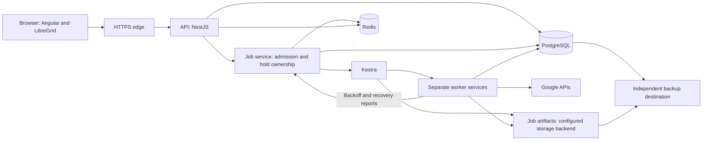

# Campus Commander: technical change instructions

> Integration update, 2026-09-05: the [design portfolio](../portfolio/README.md) incorporates this review and subsequent owner decisions.
> Use the portfolio for current planning and package status. This document preserves review evidence and rationale.

Date: 2026-09-04, America/New_York.

Status: revised technical recommendations. The [owner decision](2026-09-04-job-admission-policy.md) governs retained technologies and job admission. Other recommendations remain proposals. No application changes accompany this document.

Audience: technical lead, implementation team, security reviewer, and installation owner.

Read the [contractor report](2026-09-04-contractor-report.md) for the high-level assessment. Consult the [Google evidence note](2026-09-04-google-platform-evidence.md) and [runtime evidence note](2026-09-04-runtime-evidence.md) for supporting research.

## 1. Decision and evidence rules

Recommendations below are engineering judgments. Primary-source links support statements about published API behavior. Performance targets, capacities, retry budgets, and retention defaults are proposals, not measured results.

This plan assumes a small TypeScript team and no mandatory commercial licenses. It assumes one Workspace customer account per deployment. Google access requires outbound internet. Local hosting does not make Google administration available during a complete internet outage.

Do not convert this review into accepted architecture automatically. Record accepted recommendations in the portfolio before assigning implementation packages. Preserve rejected alternatives and the reason for rejection.

## 2. Exact document replacement map

Paths below identify current repository documents. Section titles identify replacement boundaries. Archived source documents remain historical evidence.

| ID | Cut or revise | Location | Insert instead | Acceptance reference |
|---|---|---|---|---|
| C01 | Domain equals tenant. One deployment per domain. | `docs/portfolio/01-product-brief.md`, Scale and tenancy. `02-domain-model.md`, identifiers. | One Workspace customer ID, all associated domains, one district configuration. | Sections 4 and 14 |
| C02 | Identity-only bootstrap plus DWD without signing credentials or refresh tokens | `03-architecture.md`, Google connection model. `05`, decisions 17.5, 17.12, 17.36. `06`, P3.1–P3.3. | Separate app login from offline API authorization. Add tested enterprise credentials. | Section 4 |
| C03 | Add operation durability within retained Kestra flows | `03`, Services and Jobs pipeline. `06`, P2.1–P2.3. | Kestra steps and independent workers with durable per-operation results and all-settled step aggregation. | Sections 3 and 7 |
| C04 | Late audit consolidation and filesystem-only artifact references | `03`, Core principle 4 and pipeline phases. `02`, Job and Chunk. | Preserve job files through a job-storage interface. Record intent before dispatch and results during execution. | Sections 7 and 12 |
| C05 | Redis state without explicit persistence and recovery rules | `03`, stack and signaling. `05`, 17.8 and 17.13. `06`, P5.2. | Retain Redis. Freeze approved manifests durably and recover missed events from PostgreSQL. | Sections 6 and 9 |
| C06 | Uncoordinated admission during worker backoff | `03`, Quota pacing. `05`, 17.24. `06`, P4.1 and P2.2. | Greedy workers plus owner-controlled Redis holds by job type. Pending jobs sort smallest first. | Section 8 |
| C07 | Global synchronization lock and one full-result update transaction | `03`, Scheduling and Cache Sync consistency. `05`, 17.14 and 17.26. `06`, P4.1. | Independently staged generations, short publication transaction, write reconciliation. | Section 9 |
| C08 | One timestamp describes all group and telemetry freshness | `02`, Entity type. `03`, thresholds. `04`, status bar. | Collection coverage and row observation metadata with distinct capability schedules. | Section 9 |
| C09 | Verify the retained LibreGrid integration | `03`, Grid. `04`, sections 8–10 and 15. `06`, P6.1–P6.2, P5.2. | Keep LibreGrid and validate selection, drafts, accessibility, and large-data behavior. | Section 10 |
| C10 | Global search deferred while AI is required | `01`, Roadmap and scope. `04`, header and section 13. `06`, P6.3. `07`, B7 and C3. | Cross-entity search, saved filters, defined insight views. Optional local AI later. | Sections 5 and 10 |
| C11 | Hash without stored baseline and browser-side large export | `02`, Import and export. `04`, component table. `06`, P8.1–P8.3. | Durable export baseline, streaming import/export, field-level merge rules. | Section 11 |
| C12 | Two roles with all-OU execution authority | `01`, Audience. `05`, 17.7 and 17.35. `06`, P9.1. | Scoped permissions with role presets and execution-time checks. | Section 6 |
| C13 | Compose as the complete enterprise topology | `01`, Deployment. `03`, Install experience. `06`, P9.2. | One image release, single-host Compose profile, enterprise deployment contract. | Section 13 |
| C14 | Permanent copies of every working file and 30-day downloads without distinct retention classes | `03`, pipeline and retention. `04`, retention copy. `06`, P2.3, P8.1, P9.3. | Permanent audit intent preserved through archival policy. Separate temporary data and export baselines. | Section 12 |
| C15 | Trial requires live credentials and production requires complete setup again | `01`, Deployment. `03`, Install experience. `07`, E5. | Local synthetic evaluation and explicit trial promotion. | Section 13 |
| C16 | Security, restore, and test strategy arrive after the main feature foundation | `06`, dependency graph and suggested order. `05`, open questions 44–63. | Risk-first vertical slices with release evidence. | Section 15 |
| C17 | Every migration must run forward and backward | `06`, P1.2 acceptance. | Expand/contract schema changes, compatible app rollback, and tested restore for irreversible migrations. | Section 13 |
| C18 | Settled decisions cannot be revisited. Archives retain competing authority. | `docs/portfolio/README.md`. `03` source declaration. `05`, 17.2–17.3 and usage rules. | One current architecture, superseded decision status, evidence and reconsideration triggers. | Section 15 |
| C19 | Mouse-primary compact controls and prohibition on grid-card scrolling | `04`, sections 6–7 and 11–12. `05`, G2. | Keyboard-complete grid, accessible target spacing, grid viewport scrolling, optional comfortable density. | Section 10 |
| C20 | Classroom ownership warning despite Classroom exclusion | `02`, Users and Classroom. `04`, Safety patterns. `06`, P7.2. | Remove the warning until a separately authorized Classroom capability establishes coverage. | Sections 4 and 10 |

Also revise the prototype map after accepted interaction changes. Replace its references to archived design authority with the current portfolio. Preserve visual artifacts as references. A prototype click does not prove an API action succeeds.

## 3. Target runtime and dependency choices

### 3.1 Retained topology

The job service names a logical responsibility. This diagram does not require an additional deployment container.

Keep every write operation within a job. Jobs contain steps. Steps dispatch parallel worker assignments and collect their settled results. Workers run outside the API process. Separate services or worker pools remain valid execution targets.

The small profile includes edge, API, worker, PostgreSQL, Redis, and Kestra. Serve the compiled frontend through the edge. Add worker replicas within configured resource limits. Include Redis, Kestra, and shared job storage in backup and enterprise qualification.

### 3.2 Dependency disposition

| Component | Disposition | Specific instruction |
|---|---|---|
| Angular and Material | Keep | Pin compatible supported versions. |
| NgRx Signals and Tailwind | Existing stack | Changes remain separate proposals, outside the accepted orchestration and admission decision. |
| NestJS / Express | Keep | Keep worker execution outside the API and allocate resources explicitly. |
| PostgreSQL | Keep | Store durable entities, approved manifests, operation evidence, and outbox events. |
| Kestra | Keep | Orchestrate steps, parallel batches, retry scheduling, and settlement. |
| Redis | Keep | Support caching, sessions/selections, internal broadcasts, and admission holds. |
| AG Grid Community and LibreGrid | Keep | The owner authors LibreGrid and requires its MIT distribution model. |
| pg-boss / BullMQ / Graphile Worker | Research alternatives | Do not add these as replacements for Kestra under the current decision. |
| Local model runtime | Proposed optional feature | Keep outside the default installation if the separate AI recommendation is accepted. |
| Nx / npm | Keep | Use one lockfile and enforce dependency boundaries. |

The previous recommendation to replace Kestra with PostgreSQL and pg-boss is withdrawn. The comparison understated replacement orchestration work. Redis removal and commercial-grid evaluation are also withdrawn.

Retain the primary-source comparison in the [runtime evidence note](2026-09-04-runtime-evidence.md) as a comparison of unselected alternatives. Qualification concerns the retained deployment, including Kestra's availability and edition constraints. Do not assume extra worker replicas provide full orchestrator availability.

Angular 22.0.x requires compatible TypeScript and Node versions. Pin the complete tested set from the [Angular compatibility table](https://angular.dev/reference/versions). PostgreSQL 18 remains a proposed baseline for its support horizon. Check the [PostgreSQL version policy](https://www.postgresql.org/support/versioning/) before release.

## 4. Correct the Google connection and domain model first

### 4.1 Default authentication profile

Use customer-owned OAuth authorization-code authorization for background Google API access. Request actual capability scopes and offline access. Store the resulting refresh credential encrypted. Renew access tokens through Google's authentication library and reuse them until renewal is required.

Use a dedicated district-managed admin identity with the minimum verified privileges. Do not require permanent Super Admin authority for all operations. A Super Admin still performs restricted setup tasks when Google requires that role.

Configure an Internal OAuth audience for district-only use within the customer's organization. Follow the distinct verification process if distribution requires an External audience. Reject External plus Testing for unattended production. Google documents seven-day refresh credentials for that configuration with these API scopes. [Consent configuration](https://developers.google.com/workspace/guides/configure-oauth-consent), [OAuth token lifecycle](https://developers.google.com/identity/protocols/oauth2)

Keep application sign-in separate. Identity-only OpenID Connect establishes who uses Campus Commander. It does not authorize Directory writes. App users receive local permissions and never receive the background Google credential.

Google documents the web authorization flow, offline refresh credentials, revocation, and redirect restrictions. This replaces the incomplete combination in Architecture A. [Google web-server OAuth](https://developers.google.com/identity/protocols/oauth2/web-server)

Implementation sequence:

1. Create a customer-owned Cloud project and configure the applicable OAuth audience.
2. Enable only APIs required by the selected capabilities.
3. Register the exact HTTPS redirect URI on a district-controlled hostname.
4. Validate state, issuer, audience, nonce where applicable, and the authorized district identity.
5. Use authorization-code protections supported by the selected client flow, including PKCE where supported.
6. Request offline access and the selected API scopes.
7. Encrypt refresh credentials with a versioned key outside the database backup.
8. Resolve the stable Workspace customer ID and verify the expected account.
9. Test each capability using its actual endpoint and required fields.
10. Persist credential health and scope status without exposing tokens.
11. Enable read-only synchronization before enabling writes.
12. Test renewal, revocation, restart, and replacement before accepting onboarding.

Replace per-call token generation with synchronized token renewal. Avoid parallel refresh storms. Classify credential revocation separately from permission failure, exhausted quota, and network failure. Reauthorization is not the response to every API error.

### 4.2 Enterprise credentials and fallback

Provide a credential-provider interface with `getAccessToken(capability)` and an explicit connection identity. The interface must expose expiry and credential health. It must not expose raw secrets to UI code or job artifacts.

For enterprise keyless DWD, use an authenticated workload identity and authorized service-account signing. Document the external identity source, IAM trust, signing permission, service account, Workspace DWD grant, and impersonated subject. Workload Identity Federation does not remove the need for a source identity. [Workload Identity Federation](https://cloud.google.com/iam/docs/workload-identity-federation), [service-account authorization](https://developers.google.com/identity/protocols/oauth2/service-account)

Where district policy permits keys, provide an encrypted service-account key profile as a supported fallback. Document issuance, rotation, replacement, revocation, and backup recovery. Do not advertise this profile as keyless.

Evaluate direct Workspace role assignment to a service account as a later simplification. Accept it only after every enabled endpoint passes. Support for one Chrome endpoint does not prove the whole action catalog. The [Google evidence note](2026-09-04-google-platform-evidence.md) records this distinction.

Choose the default profile before building onboarding. Do not ask an occasional installer to choose between undefined protocols.

### 4.3 Connection prerequisites and capability registry

Use a district-owned DNS name with internal resolution for LAN deployments. The browser must reach the redirect destination. Do not confuse browser OAuth redirects with public server webhooks. Verify hostname registration and certificate trust during preflight.

Remove `sslip.io` as the production default. Accept a district certificate or supported certificate enrollment. Do not require a credit card merely because the district uses Workspace. Record billing prerequisites only for an enabled service that requires billing.

Create one reviewed capability registry with these fields:

| Field | Purpose |
|---|---|
| Capability and action | Product name and precise Google method |
| OAuth scopes | Minimum scopes for read and write profiles |
| Google privileges | Required admin permissions and supported credential profiles |
| License / device requirements | Edition, enrollment, device state, or upgrade prerequisites |
| Writable fields | Field allowlist and validation rules |
| API cost | Read, write, verification, native batch, and daily-budget cost |
| Concurrency semantics | Entity ordering and aggregate limits |
| Retry class | Read, desired-state update, create, delete, command, or nonrepeatable action |
| Conditional write support | Verified method-level preconditions, or explicit absence |
| Result semantics | Accepted, applied, completed, or awaiting device result |
| Test evidence | Source URL, checked date, sandbox result, and supported version |

Generate wizard scope text and action availability from this registry. Do not retain a fixed eight-scope counter. Telemetry and reports remain separate capabilities. Add Drive and Sheets authorization only when that optional feature exists. Remove the Classroom-ownership warning until an authorized Classroom read establishes coverage.

### 4.4 Tenant and entity identity

Use the Workspace customer ID as the tenant key. Store primary, secondary, and alias domains as account metadata. Permit all supported domains within that account. Continue to exclude multiple unrelated Workspace customer accounts from one installation in the initial product. [Google users.list](https://developers.google.com/workspace/admin/directory/reference/rest/v1/users/list)

Use stable Google IDs as entity keys. Email, serial number, and OU path are searchable attributes. They are not interchangeable primary keys. Store OU parent relationships by stable ID and retain observed paths for display.

Store memberships as edges between a group and a member identity. Represent external and nested members explicitly. Label direct versus transitive membership. Define cycle handling before offering transitive queries.

## 5. Search, data access, and insight

### 5.1 Storage boundaries

Use separate PostgreSQL schemas or clearly separated table groups for `directory`, `operations`, and `security`. Keep Kestra metadata under its own supported migration process. Keep Kestra internals outside domain queries.

| Table group | Required content |
|---|---|
| Customer and domains | Stable customer ID, domains, connection configuration, capability status |
| Users / devices / groups / OUs | Indexed current attributes, Google identity, observation metadata, deletion state |
| Memberships | Group/member edge, role, type, direct membership provenance, collection freshness |
| Sync runs and staging | Generation, pages, completeness, lease epoch, failures, publication state |
| Write overlays | Confirmed local intent, external acceptance, verification state, conflict information |
| Selections and previews | Creator, filter version, frozen targets, proposed changes, approval and expiry |
| Jobs / operations / attempts | Durable state, scheduling, request identity, outcomes, reconciliation |
| Audit events | Actor, authority, operation, before/after changes, timestamps, evidence links |
| Exports and baselines | Ownership, stable row identities, schema version, baseline values, expiration |
| Event outbox and stream | Committed change notifications, replay sequence, retention watermark |

Store commonly searched attributes as typed columns. Use JSONB for bounded provider metadata and custom fields. Promote high-use custom fields into reviewed indexes. Do not index every arbitrary JSON property or store every queryable field only in opaque JSON.

### 5.2 Query contract

Define a versioned filter expression with typed field names, operators, values, and explicit AND/OR grouping. The same expression drives grid filters, saved views, previews, exports, and optional language translation. Compile it into parameterized SQL through an allowlist.

Set initial limits: expression depth eight, 100 predicates, 100 default rows, and 500 maximum rows per response. Limit sortable fields and projected columns. Reject expensive unsupported expressions with a clear explanation. Treat these as initial limits to validate.

Use exact lookup first for email, alias, serial number, asset ID, and stable IDs. Rank exact matches above prefix matches. Apply trigram matching only to chosen descriptive fields. Use full-text search for longer notes only when it serves an explicit workflow.

Candidate indexes include normalized email, alias lookup, serial number, asset ID, OU/status combinations, and membership edges in both directions. Include a stable entity ID as the final sort key. Test Unicode names, accents, punctuation, numeric-looking identifiers, and case handling. Preserve display values separately from normalized lookup values.

PostgreSQL supplies trigram and full-text indexing. Their existence does not prove the proposed query workload meets latency targets. [pg_trgm](https://www.postgresql.org/docs/current/pgtrgm.html), [full-text search](https://www.postgresql.org/docs/current/textsearch.html)

Use cursor pagination for sequential results. Bind each cursor to the normalized query, sort, generation, and permission version. Reject stale cursors explicitly when required ordering changes. Do not retain database transactions while a browser navigates.

The Community grid requests numeric row ranges. Implement an adapter with bounded block caching and cursor anchors. Use bounded offsets only for shallow jumps. For arbitrary deep jumps, materialize a temporary ordered ID result or require another filter. Do not claim ordinary keyset pagination supports instant jumps to arbitrary row numbers.

Compute exact counts for a frozen preview. Do not make every keystroke wait for a complex exact count. Return rows first and count status separately. Label incomplete counts. Count permissions must match row permissions.

### 5.3 First-release insight

Move cross-entity lookup into the first read-only slice. Search users, devices, groups, and OUs together. Show entity type, identifying fields, OU or group context, and observation age. Link each result to an authorized detail view.

Add saved reports with explicit definitions. Start with devices beyond support date, stale device contact, suspended users with remaining memberships, and device inventory by OU. Add battery summaries only after telemetry coverage exists.

Every report must expose its definition, filters, observation time, missing-data count, and drill-through entities. Use PostgreSQL aggregate tables or materialized views where query measurements justify them. Label thresholds as district policy. Do not invent Google policy or predictive accuracy.

Name three separate capabilities: inventory reports, Chrome fleet reports, and Google external audit. Initial inventory reports do not describe actions outside Campus Commander. Offer external audit ingestion as a separate connector after core reporting works. Request `admin.reports.audit.readonly` for that connector. Record event identity, provider time, ingestion time, coverage gaps, and application-specific delay. Google's documented retrieval window is 180 days. Local retention does not extend Google's historical retrieval. [Reports activities reference](https://developers.google.com/workspace/admin/reports/reference/rest/v1/activities/list)

Keep SIS ownership visible in user-management workflows. Define which fields the SIS or another sync tool controls. Warn or reject writes that district policy assigns to that external system. An apparently successful update that another tool immediately reverses is an operational failure.

## 6. Permissions, selection, and preview

### 6.1 Authorization model

Replace two global roles with permission grants and simple role presets. Presets should include platform administrator, district operator, school operator, and viewer. Keep the policy engine small. Do not install a separate identity server unless district integration requires it.

Represent a grant as principal, capability, action, resource scope, field scope, and constraints. Model schools as explicit district-defined scopes. A school does not always equal one OU subtree.

Apply authorization to searches, counts, details, selections, previews, exports, jobs, audit access, and event delivery. Recheck permissions at confirmation and before dispatch. Increment a permission version whenever a grant changes. Pause queued work after its permission version becomes invalid.

Validate both source and destination scopes for moves. Use stable OU IDs through rename and reparent operations. Give groups explicit scope assignments. Groups lack the same OU boundary as users and devices. Do not infer group authority from the email domain alone.

The shared Google actor does not enforce individual Campus Commander user permissions. Google also limits which admin privileges support OU restriction. The application must enforce its own boundaries. [Google administrator privilege definitions](https://support.google.com/a/answer/1219251)

Require a separate approver for district-defined high-impact actions. Proposed defaults include mass powerwash and unusually large suspension jobs. Prevent the requester from satisfying a two-person rule. Bind approval to the exact manifest and permission version.

Use established OIDC libraries for app sign-in and support the district identity provider. Match invited users by verified identity, not an unverified email claim. Keep opaque sessions in Redis with explicit expiration and recovery rules. Use secure, HttpOnly cookies, CSRF protection, bounded session expiry, and audited recovery. Validate authorization after session renewal and role changes.

### 6.2 Durable selection

Keep compact selection requests and Redis-backed selections. An opaque selection ID is a reference, not an authorization credential. Freeze the confirmed target manifest in durable storage before dispatch.

Store creator, customer, filter expression, filter version, permission scope, included IDs, excluded IDs, selection revision, and timestamps. Support explicit selection and all-matching selection. Preserve the original filter when the displayed filter changes. Show the resulting selection scope clearly.

Define Redis persistence and recovery for browsing selections. Preserve approved manifests independently of Redis expiration. Expire abandoned selections under a documented policy.

### 6.3 Preview and confirmation contract

Use one process for one-row and million-row changes:

1. Validate the current principal and action.
2. Resolve the selection against an explicit local data generation and permission scope.
3. Materialize target IDs, local versions, proposed field changes, and required preconditions on the server.
4. Count eligible, excluded, invalid, conflicting, and unchanged targets.
5. Store an immutable preview manifest and its digest.
6. Display exact counts with a paginated target list and impact explanation.
7. Obtain confirmation and any required second approval.
8. Recheck permission version, manifest digest, action version, and expiration.
9. Create the job and its initial audit events in one database transaction.
10. Return a durable job receipt.

For large manifests, build a private staging result and publish it only after completion. Pin the required source generation during construction. Do not hold a browser-owned transaction or transfer all target IDs to the browser.

Use a proposed 15-minute confirmation window for prepared previews. Long-running preparation starts that window only when ready. Scheduled jobs retain frozen targets and require execution-time revalidation. A schedule must not silently select newly matching entities.

Local versions cannot establish that Google remained unchanged. Read affected live fields before a sensitive write. Use verified conditional requests where a specific method supports them. Otherwise document the residual race between read and write. Do not promise transactional consistency across Google and PostgreSQL.

Stop conflicting targets for renewed review. Do not silently apply different values from those approved. Replacing an actor, action definition, target set, or parameter invalidates the previous approval.

## 7. Add durable operation evidence to Kestra jobs

### 7.1 Durable state and dispatch

Keep business operation evidence independent from Kestra retention. Link the application job to its Kestra execution, step, and worker assignment. Keep per-operation results within each assignment. Execution cleanup must not remove audit history.

Proposed job states: `preparing`, `awaiting_confirmation`, `approved`, `queued`, `running`, `paused`, `completed`, `completed_with_errors`, and `cancelled`. Represent unresolved external outcomes explicitly in job counts and status. Do not call a job complete while required reconciliation remains unresolved.

Proposed operation states: `pending`, `leased`, `dispatch_recorded`, `accepted`, `verifying`, `succeeded`, `failed`, `skipped`, `unknown`, and `cancelled`. Preserve attempt history instead of overwriting the previous failure.

The application owns an operation uniqueness key containing customer, job, target, action version, and substep. A client confirmation idempotency key prevents duplicate job creation. Neither key creates an idempotency feature in a Google method that lacks one.

Record accepted intent and a dispatch outbox together in PostgreSQL. The dispatcher checks type-specific admission before triggering Kestra. Deduplicate ambiguous trigger attempts through a stable application job identity and execution lookup. Test recovery across database, Redis, file storage, and Kestra boundaries.

### 7.2 Dispatch protocol

1. Claim a bounded operation set with a lease epoch and expiry.
2. Validate cancellation, current permissions, dependencies, and preview preconditions.
3. Respect execution concurrency and per-request backoff. The admission hold does not stop existing jobs.
4. Record an immutable attempt and request digest before the external request.
5. Commit that record before sending the request.
6. Call Google with a bounded timeout.
7. Commit the classified outcome, entity overlay, audit event, and notification outbox together.
8. Schedule verification or reconciliation when required.
9. Settle the worker assignment only after durable application state commits.

An attempt records the local requester and the external Google actor separately. Record the endpoint, target, changed fields, timestamps, response classification, provider request identifier when available, and command ID. Never record access tokens, temporary passwords, or unfiltered response bodies.

Do not keep a database transaction open during a network request. Stop new dispatch if the database cannot durably record intent. If the response arrives during a database outage, retain it in a bounded emergency journal when storage permits. Treat the operation as unknown if durable outcome evidence is unavailable. Never substitute success inference for missing evidence.

### 7.3 Unknown outcomes and fencing limits

A worker can crash after Google applies a request but before the result reaches PostgreSQL. Recovery must distinguish that interval from a request known to have failed before transmission.

Leases and fencing tokens protect application state from stale workers. Google does not honor the application's fencing token. A local lease does not prevent a delayed request from reaching Google. After lease expiry, route dispatched operations through reconciliation before permitting another unsafe request.

Serialize operations that affect the same entity. Block dependent operations while an earlier outcome remains unknown. For membership changes, lock the group/member edge. For OU structural changes, lock the affected structural scope. Acquire multiple locks in a deterministic order.

| Operation class | Recovery rule |
|---|---|
| Read | Retry with bounded randomized backoff. |
| Set a field to an approved absolute value | Fetch current state. Verify preconditions before repeating. Preserve external changes on other fields. |
| Append or prepend text | Compute the approved final value once. Never append again from the current value on retry. |
| Create user or group | Reconcile identity and creation evidence. An existing name alone does not prove this job created it. |
| Membership add/remove | Read current edge state and classify the desired result. Preserve role-change conflicts. |
| Delete | Verify absence and audit evidence. Do not infer attribution merely from absence. |
| Sign-out or password-related action | Classify each action separately. Do not assume repetition has no operational effect. |
| Device command | Persist the command ID and poll its state. An unknown issuance without a recoverable ID requires operator review. |

HTTP batching does not provide ordering or a transaction. Parse each enclosed response. Never place dependent operations in an unordered batch. [Google batching semantics](https://developers.google.com/workspace/admin/directory/v1/guides/batch)

### 7.4 Work size and cancellation

Use bounded worker assignments with independent per-operation results. The owner's example uses 500 operations per assignment. Treat assignment size, active worker count, and provider batch size as separate controls. Retry eligible unresolved operations without repeating successes. Complete the step after every assignment settles according to its result policy.

Separate transport batching from scheduling size. Use verified native bulk methods and their limits. The device OU move and status-change methods each accept bounded device sets. A provider batch remains one API-specific request, with result handling defined by that method.

Check cancellation before every external request and after every result. Stop new dispatch immediately after cancellation becomes visible. Already transmitted requests still require reconciliation. Preserve confirmed successes and unknown outcomes. Do not describe cancellation as rollback.

Keep Kestra step execution outside the API. Authenticate internal worker endpoints and restrict network access. Define request identities, timeouts, and execution fencing for callbacks. Steps can run in separate worker services.

### 7.5 Files and durable operation evidence

Keep one mutation protocol for every action size. Preserve the original rationale that small changes require the same scrutiny as large changes.

Generate canonical manifests, per-operation audit records, and result files from the durable ledger. Store content hashes, schema versions, and authorized download references. Keep temporary parse files separate from permanent evidence. Do not copy the complete entity snapshot into every operation artifact.

Preserve the mandatory file evidence for every mutation, including a one-row job. Publish the manifest before dispatch. Record results as operations settle and consolidate the final archive through Kestra. Final consolidation must not be the first durable record of external work.

Use the job-storage interface defined below. Start with persistent local storage on one host.
Qualify a shared backend before distributing workers across hosts.

### 7.6 Job-storage interface and artifact publication

**Owner direction:** Define the job-storage interface before implementation. Implement local storage first.
Shared filesystem storage and S3-compatible object storage are the two supported design paths for distributed workers.
Select and qualify at least one shared backend before enabling workers on multiple hosts.
The detailed interface and publication protocol below remain implementation proposals.

| Backend | Artifact location and worker access | Required qualification |
|---|---|---|
| Local filesystem | Persistent volume mounted into each component that reads or writes job files on one host | Permissions, durable writes, restart recovery, and backup |
| Shared filesystem | District file storage mounted into every participating worker and artifact consumer | Cross-host visibility, rename behavior, durability, mount failure, and access control |
| S3-compatible object storage | District-operated bucket accessed through a configured endpoint. Workers stream or download inputs and upload results. | Upload completion, checksums, read visibility, credentials, interrupted transfers, and retention |

S3 compatibility does not require Amazon hosting. Keep object storage optional for the default installation.
Shared filesystem storage preserves the existing filesystem contract inside its adapter.
Object storage explicitly replaces that contract with artifact reads, writes, and publication.
Preserve mandatory manifests, result files, and audit artifacts in every backend.

**Contract boundary.** Pass opaque artifact IDs in job and assignment messages.
Resolve each ID through PostgreSQL metadata containing its backend, locator, checksum, size, schema version, job identity, and publication state.
Keep credentials and temporary download URLs outside durable job payloads.
Keep backend-specific paths and object keys inside the adapter.

| Proposed operation | Contract |
|---|---|
| `stage` | Stream bytes into a unique artifact for one execution attempt. Return its ID, size, and checksum. |
| `inspect` | Verify artifact existence, identity, transfer completion, and integrity evidence. |
| `publish` | Mark a verified artifact ready through the application metadata transaction. Repeated identical publication returns the existing result. |
| `openRead` | Authorize access and stream a published artifact. Reject unpublished or missing artifacts. |
| `remove` | Delete an artifact only through retention or abandoned-upload cleanup after checking references and active work. |

Keep publication in the application service. Storage adapters supply transfer and verification operations.
Do not expose append, filesystem locks, atomic rename, or directory scans as requirements of the common interface.
Workers that require local paths materialize inputs in bounded temporary workspace through the adapter.
These temporary copies are disposable. Published artifacts remain the recovery source.

**Publication protocol.** Allocate a unique artifact ID and record staging intent before writing bytes.
Write immutable attempt-specific artifacts. Never let workers append concurrently to one result file.
Complete the write and verify its recorded size and checksum before publication.
Commit ready state and the job or assignment reference in one PostgreSQL transaction.
Consumers discover artifacts through ready metadata and published manifests.
Directory and bucket listings do not determine job completion.

A filesystem adapter uses temporary files and backend-qualified publication operations, including rename where supported.
An object adapter uploads directly to a unique immutable key and completes the upload before publication.
Generic S3 compatibility does not establish an atomic rename contract.
Amazon documents ordinary object rename through copy and delete. [S3 object operations](https://docs.aws.amazon.com/AmazonS3/latest/userguide/copy-object.html)
Multipart upload requires completion or explicit cleanup. [S3 multipart uploads](https://docs.aws.amazon.com/AmazonS3/latest/userguide/mpuoverview.html)
Verify the chosen provider instead of extending Amazon guarantees to every compatible implementation.

Storage writes and PostgreSQL publication do not share one transaction.
After a crash, reconcile staged artifacts before retrying publication or scheduling cleanup.
Reject stale attempts when attaching outputs to the authoritative assignment result.
Protect active uploads from cleanup. Retain referenced artifacts under their retention policy.
Verify content with an explicit checksum. Do not assume an object ETag equals the content checksum.

**Kestra boundary.** The application job-storage interface does not automatically configure Kestra internal storage.
Keep application artifacts and Kestra internal storage separately configured and documented.
Qualify the selected Kestra storage plugin and every component that accesses its files.
A shared physical service is valid when both integrations pass their compatibility tests.

**Implementation sequence.** Define artifact references and the interface before writing worker handlers.
Implement the local adapter and run the first audited mutation through it.
Next, qualify shared filesystem storage or object storage against the same contract.
Test interrupted writes, duplicate publication, checksum mismatch, storage outages, stale attempts, and cross-host reads.
Test restart between upload completion and PostgreSQL publication.
Require unpublished artifacts to remain unavailable to job consumers in every case.
Restore database records and matching artifacts together before enabling distributed production work.

When moving storage, pause affected dispatch, copy artifacts, verify checksums, and update backend locators while preserving artifact IDs.
Verify reads and restore procedures before resuming jobs. Retain the previous copy until migration validation completes.

## 8. Greedy workers with Redis job admission holds

### 8.1 Accepted policy

Follow the [owner's job admission decision](2026-09-04-job-admission-policy.md). The hold applies to new jobs of the affected type. Existing jobs continue their remaining steps, assignments, and retries.

Workers send backoff reports to the job service. The job service writes the reporting job's ID with a 300-second TTL. Another active job's report deliberately replaces that owner. Reports continue during backoff and reset the TTL. Only cleanup requires matching ownership. The owner also permits early release after a configurable sequence of successful calls.

Pending jobs sort smallest to largest. Use frozen operation count and FIFO ties as proposed ordering details. Retain configured execution capacity when releasing jobs. Do not drain the complete queue into workers at once.

Workers still in backoff keep reporting through the job service and reestablish their job's hold. A finishing job clears its own hold. Without further accepted reports, the hold expires five minutes after its last update. A small job waits during a hold, then receives priority over larger pending jobs.

### 8.2 Implementation safeguards and limits

The job service compares owner and deletes atomically in Redis. Backoff updates intentionally overwrite ownership and expiration together. Track a bounded list of each job's hold keys for cleanup. Cover failed and cancelled executions as well as normal completion.

Five-minute expiration and continuing-backoff reports are accepted behavior. Do not renew from cached worker state after reports stop. Reject stale reports using job execution state. Aggregate recovery observations in the job service. Proposed early-release safeguards include a hold revision and deduplicated worker events. The threshold and counted success unit remain unselected. Five calls was the owner's example.

Keep randomized per-request backoff and method-specific error classification. A permission failure is not a quota signal. Inspect inner responses from HTTP batches. Do not count an outer HTTP success as proof that all operations succeeded.

The accepted design does not introduce quota tokens, fixed capacity shares, a global Google cooldown, or inferred burst limits. Observe throughput, backoff, queue age, and small-job delay. Do not claim that smallest-first ordering prevents starvation under continuous small-job arrivals.

### 8.3 Quota arithmetic and admission

Estimate job duration from observed throughput before confirmation. Include live checks, retries, and verification in the estimate. Label it as an estimate. Do not infer remaining Google quota from it.

Examples below use documented nominal rates, no competing traffic, and no retries. They illustrate sustained budget consumption. They are not strict elapsed-time bounds or predictions of Google burst enforcement.

| Work | Simplified bound |
|---|---|
| 100,000 single-request writes at 2,400/minute | 41.7 minutes |
| Same writes plus one live read per target | 83.3 minutes before result verification |
| 1,000,000 single-request writes | 416.7 minutes, or 6.94 hours |
| 100,000 user creations at 10/second | 2.78 hours under that method limit |
| 10,000 Group Settings reads every hour | 240,000 daily requests, above the documented 100,000 default |
| 50,000 groups with 400 direct members each | 100,000 membership pages at 200/page, excluding group inventory and settings |

Calculate membership requests as the sum of page counts per group. Empty groups still require a request to establish emptiness. Skewed groups and nested membership change the cost. A count of groups alone does not predict sweep duration.

Reject or defer work when estimated completion exceeds a declared maintenance window. Let administrators choose a smaller selection or a later schedule. Do not silently lower safety checks to meet the window.

## 9. Synchronization without a district-wide write freeze

### 9.1 Separate local publication from external truth

Retain polling as the baseline for restricted networks. Keep full enumeration for reconciliation and deletion evidence. Add targeted reads after mutations and for explicitly requested details. Do not invent an incremental token for an API that lacks one.

Distinguish collection completion, row observation time, provider event time, and pending local changes. A full sweep spans time. It does not represent a single instant in Google, even if PostgreSQL publishes it atomically.

Split users, device inventory, OUs, groups, memberships, Group Settings, telemetry, and reports into separate schedules. The existing one-hour group threshold must not imply complete hourly membership and settings coverage.

### 9.2 Generation-based publication

1. Claim a collection lease with a monotonically increasing epoch.
2. Create a new unpublished generation and persist the listing parameters.
3. Fetch pages with bounded concurrency, per-request backoff, and durable page checkpoints.
4. Write each page into staging with uniqueness constraints and bounded transactions.
5. Validate page-chain completion, capability coverage, duplicates, and record counts.
6. Reject publication after cancellation, incomplete coverage, or a stale lease epoch.
7. Publish the generation through one short metadata transaction.
8. Emit a collection revision event in that transaction.
9. Reconcile pending write overlays against observed records.
10. Retire previous generations after readers, previews, and exports release their references.

Build indexes and perform bulk loading before publication. Do not make one transaction rewrite an entire million-row collection while holding the global job lock. Budget temporary storage for active and staging generations. Benchmark query overhead from the generation key.

Retain at least the active generation until a complete replacement publishes. Abandoned staging generations are recoverable or removable through explicit lifecycle rules. Invalid page tokens restart the affected listing generation. They never authorize deletion from a partial result.

### 9.3 Reconcile writes during synchronization

Store provider observations separately from application write overlays. A successful write records its intended changed fields and acceptance time. The grid shows accepted-but-unverified values with that status. Do not overwrite an entire row with values the application merely requested.

A published sweep cannot erase a newer accepted write with an older observation. Retain the overlay until a targeted read verifies the result or establishes a conflict. A matching value establishes observed state, not proof of which actor produced it.

If a newer observation conflicts with approved intent, expose reconciliation status. Recheck the operation's fields and timing. Preserve unrelated fields from the latest observation. Define an operator resolution for persistent disagreement and external management-tool overrides.

Use one effective read model for display, filtering, sorting, counts, selection, and export. Apply overlays before evaluating predicates. Otherwise a moved device displays its new OU while remaining selected under its old OU. Index the effective projection and include overlay volume in query benchmarks. Generation publication must preserve this contract, including pending deletions and new entities.

### 9.4 Deletion and coverage

Mark absence only after a complete, authorized enumeration of the same collection scope. Permission changes and failed pages must not produce mass deletion. Quarantine unexpectedly large disappearance counts and run diagnostics before publication.

Use a separate deletion or absence state from permanent erasure. For sensitive disappearance, require a targeted check or a second complete sweep. Do not show partial group membership as an empty group.

### 9.5 Event delivery

Keep SSE, Redis Pub/Sub, and a durable PostgreSQL outbox. Publish invalidations after durable state commits. Recover missed broadcasts through replay or an explicit client resync. Apply authorization at each API replica.

Give the browser a replay cursor and a retention watermark. After disconnect, replay authorized events or issue a full resync instruction. Do not assume notifications arrive exactly once. Suppress duplicate entity versions and coalesce repeated invalidations.

Use a committed event publisher to assign stream order. A database sequence allocated inside concurrent transactions does not by itself establish commit order. Test a slow earlier transaction that commits after a later event. The replay cursor must not skip that earlier change.

Events contain only required identifiers, event type, and version. Apply current permissions before delivery and replay. Entity identifiers themselves disclose information. Return current data through the authorized query API.

## 10. Grid, editing, accessibility, and AI

### 10.1 Retained LibreGrid integration

Keep AG Grid Community with LibreGrid's server-side row model, selection, filters, and required feature modules. Test the application's actual data and editing behavior. Commercial grid licensing is outside the owner's distribution budget.

Integrate the server-side selection provider with Redis selections and durable preview freezing. Keep draft values outside the grid's currently loaded rows. Validate selection across paging, sorting, filtering, grouped rows, and concurrent updates.

Pin the compatible AG Grid and LibreGrid versions. Test keyboard operation, screen-reader behavior, memory, and request bounds under representative load. The [LibreGrid repository](https://github.com/libregrid/libregrid) documents package availability and its peer range.

### 10.2 Editing behavior

Replace conflicting write-through and batch-edit expectations with a clear default. Cell edits create drafts. Save produces a preview and confirmed job. Offer a direct single-field action that uses the same process when needed.

Store drafts by entity ID and field, outside loaded grid rows. Retain baseline version and proposed value. Preserve drafts through scrolling, filtering, sorting, and SSE refresh. Mark conflicts when observations change. Never discard a draft because its row leaves the browser cache.

For large paste operations, stage edits server-side and return a draft ID. Use the same validation and streaming limits as import. Distinguish resetting an unsaved draft from undoing a completed Google action.

Give one-field previews a concise presentation. Keep all safety checks. Reserve extra acknowledgments for destructive or unusually broad changes. Repeated identical dialogs create confirmation fatigue without increasing evidence quality.

### 10.3 Accessible operation

Adopt WCAG 2.2 AA as an engineering acceptance target. Test complete workflows with a keyboard and representative screen readers. Include grid navigation, selection, menus, edit validation, dialogs, virtualized content, and job progress. [WCAG 2.2](https://www.w3.org/TR/WCAG22/)

Remove the mouse-primary requirement. Permit grid-card scrolling because row virtualization needs a bounded viewport. Provide a comfortable density option if user tests require it. Ensure small controls satisfy target-size rules or their permitted spacing exceptions. A 20-pixel control is not automatically compliant or automatically noncompliant. [Target-size guidance](https://www.w3.org/WAI/WCAG22/Understanding/target-size-minimum.html)

Make freshness, errors, pending writes, and selection scope available through text. Preserve focus after updates. Coalesce background announcements so synchronization does not overwhelm assistive technology.

### 10.4 Optional language assistance

Remove local model runtime from installation prerequisites and the first release gate. Ship typed filters, saved searches, and report templates first.

If language assistance later passes evaluation, restrict it to producing the filter expression. Validate fields, operators, depth, and query cost. Show translated filters before applying them. The model must not execute SQL, issue writes, or bypass authorization.

Do not promise universal anonymization of free text. Names and other identifying values can occur in unrecognized forms. Keep inference local, disable prompt retention by default, and describe the actual data boundary. Use an explicit evaluation set covering ambiguous requests, unsupported fields, injection attempts, and latency under low-memory conditions.

## 11. Imports, exports, and large updates

### 11.1 Export baseline

Replace the hidden-hash-only design with an export record and stored baseline. A CSV column cannot reliably remain hidden. Treat identity and integrity columns as visible machine metadata.

Store export ID, creator, permission scope, schema version, selected columns, creation time, expiration, and baseline reference. For each row, store stable entity ID and baseline values for exported editable fields. Sign row metadata or validate it against the server record. A hash alone cannot reconstruct old field values.

Stream output from a pinned dataset or immutable ordered ID result. Keep memory bounded. Generate downloadable files in workers and expose progress through the job surface. Do not create a million-row workbook in the browser.

Apply CSV formula-injection protection without corrupting the import contract. Preserve original values in the server baseline. Specify escaping and unescaping rules for spreadsheet consumers. Test values beginning with formula characters, leading zeros, Unicode, embedded newlines, quotes, and long cells.

### 11.2 Three-way merge rules

Let `B` denote baseline, `E` the edited value, and `C` the current live value. Compare canonical field values, not display strings.

| Condition | Result |
|---|---|
| `E = B` | No user edit. Keep current value. |
| `E != B` and `C = B` | Proposed update to `E`. |
| `E != B` and `C = E` | Already at the requested value. No write. |
| `E != B`, `C != B`, and `C != E` | Conflict requiring an explicit decision. |
| Baseline expired or missing | Reject round-trip comparison. Offer a separate new-import workflow. |
| Unknown stable ID | Report invalid identity. Create only through an explicit create mode. |

Define null, empty, absent, array ordering, date, and whitespace semantics for each field. Reject duplicate identities with conflicting edits. Treat immutable identifiers as metadata, not editable fields.

Recompute hashes from canonical imported values. Do not trust a user-supplied hash to skip validation. Restrict the changed-row fast path to correctly matched export rows and schemas.

Persist conflict decisions and bind them to observed values. Revalidate before dispatch because live state changes during review. Do not overwrite complete rows when the user edited one field.

### 11.3 Resource limits and failure handling

Stage uploads with byte, row, column, and cell-length limits. Stream parsing into bounded staging batches. Reject malformed encoding, unexpected columns, duplicate headers, compressed expansion abuse, and unsupported schema versions. Record partial parse progress without publishing a valid import prematurely.

Keep the current 50,000-row limit during the first qualification stage. Target 1,000,000 CSV rows for the large profile. Raise the supported limit only after the combined workload passes. The app should split accepted work internally. Users should not need to split district files manually.

Display create, update, unchanged, conflict, invalid, and unauthorized counts separately. Offer downloadable errors with stable row references. Resume validated imports after restart without repeating successful writes.

Keep Google Sheets integration optional after CSV round-trip correctness. Define the actual document principal, file ownership, sharing boundary, and selected-file authorization. The Directory credential does not imply access to the operator's Drive. Test file limits and authorization independently.

For user creation, generate secrets server-side and exclude them from sheets and audit artifacts. Define a protected one-time delivery or district-approved password recovery process. Do not leave account creation unusable because nobody can obtain initial access.

## 12. Audit, retention, and operational visibility

### 12.1 Audit evidence

Audit acceptance, approval, dispatch, results, cancellation, reconciliation, credential changes, permission changes, exports, and retention changes. Include requester, approver, effective permission version, Google actor, target IDs, changed fields, and time sources.

Keep permanent mutation evidence as the default product intent. Move older evidence to archive without losing discoverability. Do not retain every temporary working file forever. Separate the local audit index from immutable archive evidence.

Restrict audit modification through a database role that application request handlers cannot use. Use a dedicated archival role. Hash canonical evidence bundles and record signed checkpoints outside the application's administrative boundary when stronger tamper evidence is required.

Document the trust limit: a host administrator controlling data, keys, and backups can alter local evidence. Separately controlled immutable storage addresses that boundary. A second writable directory on the same host does not.

### 12.2 Proposed retention classes

These are product defaults for district review, not legal retention advice.

| Data | Proposed default | Required behavior |
|---|---|---|
| Mutation and security audit | Permanent logical retention, with archive tiers | Preserve searchable references and integrity evidence. Require an explicit policy change for deletion. |
| Downloadable results | 30 days | Display expiration and permit authorized regeneration when source evidence remains. |
| Export baselines and input files | 30 days or the district's shorter approved policy | Expiration ends round-trip comparison. Remove sensitive input on schedule. |
| Sync staging | Delete abandoned generations after recovery review and bounded grace | Never delete an active or referenced generation. |
| Queue records | Short operational retention | Preserve history in domain and audit tables before queue cleanup. |
| Operational logs | 14 days with size caps | Redact secrets and sensitive payloads. Rotate without filling the host. |
| Battery samples | 30 daily samples plus 24 monthly aggregates initially | Record missing coverage. Validate usefulness and capacity before expansion. |

Keep retention settings versioned and audited. Record legal holds as district-supplied requirements. Expire data in replicas and backups according to the documented backup policy. Do not promise immediate erasure from historical backups.

### 12.3 Metrics and degraded behavior

Expose structured logs and metrics from every process. Correlate request, preview, job, operation, attempt, sync generation, and Google request IDs. Keep product audit separate from diagnostic logs.

Required metrics include search latency, pool wait, slow queries, queue age by job type, hold duration, retry reasons, unknown outcomes, and command age. Also record collection lag, overlay age, event backlog, archive delay, disk growth, backup age, and restore verification date.

| Failure | Required product response |
|---|---|
| Google outage or exhausted quota | Serve local reads with freshness status. Queue eligible work and show the next attempt. |
| Expired or revoked credentials | Pause the affected capability and provide the exact reconnect action. |
| PostgreSQL unavailable | Stop new mutations. Do not report accepted work without a durable receipt. |
| Artifact storage unavailable | Block artifact-dependent work. Keep unrelated reads available. |
| Low disk | Warn at a proposed 20% free. Stop new large imports and sweeps at 10% or insufficient reserved capacity. |
| Audit persistence failure | Stop new external dispatch. Reconcile requests already in flight. |
| Lost SSE stream | Reconnect and replay or resynchronize. Preserve drafts and selection. |
| Stale data beyond policy | Display age and coverage. Block sensitive actions that require unavailable live validation. |

Use workload estimates as well as percentage disk thresholds. A large staged import requires reserved capacity before it starts. Keep emergency logging bounded. No design can guarantee new durable writes after all available storage fails.

Offer a redacted support bundle with versions, configuration shape, health checks, and recent failure codes. Require deliberate inclusion of entity content. Do not send support bundles automatically to a vendor.

## 13. Installation, enterprise deployment, backup, and upgrades

### 13.1 One-host installation

Publish signed, immutable OCI images and a versioned release manifest. Include an SBOM and checksums. Pin images by digest. Customers must not compile the repository during installation.

Ship Compose configuration, a Linux installer, local help, and a sample-data profile. Keep development configuration separate. Publish only the HTTPS edge port by default. Keep database and worker interfaces internal.

Generate unique database and bootstrap credentials during installation. Mount secrets through protected files or the district secret provider. Avoid secrets in command output, logs, browser storage, and image layers. Reserve the first setup session with a short-lived bootstrap secret.

Installer sequence:

1. Validate supported OS, CPU architecture, time synchronization, disk, memory, and container runtime.
2. Explain runtime installation before requesting host privileges.
3. Verify release signatures and image checksums.
4. Check listening ports and configure the district hostname.
5. Validate certificate trust and required outbound destinations.
6. Create isolated volumes and unique secrets.
7. Start PostgreSQL and run the release migration once.
8. Start Redis, Kestra, API, worker, and edge services with health checks.
9. Open the local setup screen with a temporary bootstrap credential.
10. Offer sample data or a read-only Google connection.
11. Configure a separate backup destination and test one backup.
12. Show connection progress, supported capacity, and unresolved prerequisites.

Keep Google approval and inventory completion outside the local-install progress percentage. External propagation can exceed one session. The wizard should resume and describe the required actor or policy change. Email notifications remain optional through district SMTP. In-app progress must work without email configuration.

Support air-gapped artifact transfer for installation where needed. Runtime Google access still requires egress. Package fonts, scripts, styles, and help locally. Provide an endpoint inventory for network administrators and test explicit proxies.

Keep trial promotion explicit. Remove sample data, verify customer identity, establish production secrets and backup, and preserve authorized configuration. Test promotion independently from reinstall. Do not silently carry trial write approvals into production.

### 13.2 Enterprise deployment contract

Publish the same application images with these supported external interfaces:

| Interface | Contract |
|---|---|
| PostgreSQL | Tested major, required extensions, TLS, roles, pool budget, migrations, failover behavior |
| Artifact storage | Job-storage interface from section 7.6. Qualified shared filesystem or S3-compatible backend for distributed workers. |
| Identity | OIDC metadata, claims mapping, invitations, revocation, and recovery |
| Secrets | File or district provider interface, key versioning, rotation, and restore |
| Ingress | HTTPS, SSE timeout and buffering requirements, request-size limits |
| Observability | Metrics endpoint and optional OTLP export with redaction |
| Scheduling | Kestra workers, execution leases, type-specific Redis holds, and size-ordered job admission |

Support stateless API replicas and restartable workers. Keep mutable job data out of container filesystems. Elect singleton scheduling and publication responsibilities through tested database coordination. Avoid relying on a host clock for lease ordering.

Provide one reference deployment for the enterprise platform selected by the pilot district. Use its existing load balancer, certificate authority, backup system, and secrets management. Qualify OpenShift or other distributions separately when procurement requires them. Do not equate ordinary Kubernetes compatibility with district acceptance.

Document single-host limits clearly. More containers on one host do not provide host failure tolerance. PostgreSQL replication requires an explicit failover system and tested fencing. Read replicas add lag and must not serve confirmation or operation-state decisions without consistency controls.

### 13.3 Backup and restore

Use pgBackRest or the district's operated PostgreSQL backup system. Back up database state, artifacts, configuration, encryption-key recovery material, and certificate recovery material. Keep the backup destination outside the production host failure domain. [pgBackRest guide](https://pgbackrest.org/user-guide.html), [PostgreSQL recovery](https://www.postgresql.org/docs/current/continuous-archiving.html)

Proposed objectives:

| Profile | Recovery point target | Recovery time target | Condition |
|---|---|---|---|
| Small host | At most 24 hours of local data | Four hours | Daily verified off-host backup and available replacement host |
| District standard | At most 15 minutes | Two hours | Continuous WAL archive and rehearsed artifact restore |
| Enterprise | At most five minutes | One hour | District-operated HA, tested failover, and recovery staffing |

These targets require measurement. They do not authorize loss of known mutation evidence. Enterprise deployments requiring zero lost accepted operations need a separately tested synchronous durability and independent-audit design. Replication does not replace backups.

Restore procedure:

1. Start the recovered installation with all Google mutations disabled.
2. Restore matching database, artifacts, and key versions.
3. Verify checksums and the last independent audit checkpoint.
4. Identify operations affected by the recovery-point gap.
5. Reconcile current Google state and available external audit evidence.
6. Quarantine uncertain creates, deletes, commands, and other unsafe replays.
7. Revalidate credentials, customer identity, permissions, and active schedules.
8. Resume read-only synchronization.
9. Release safe work only after documented reconciliation.

Google does not revert when a local database restores to yesterday. Never resume a restored queue automatically. Restored jobs that look unfinished already have external effects in some cases.

### 13.4 Upgrade and uninstall

Use expand/contract database migrations. Keep the previous application release compatible during a declared rollback window. Run a single migration job before changing worker versions. Pin action versions in manifests so queued work cannot acquire new semantics after upgrade.

Test upgrades with active jobs, paused jobs, imports, expired leases, and old audit records. Back up before irreversible changes. Use a forward fix or verified restore when a schema change cannot reverse safely. Do not require destructive down-migrations merely to satisfy a generic test.

Define separate stop, uninstall, and erase-data actions. Remove the current promise that `docker compose down -v` removes bind-mounted secrets. Docker documents that command's volume behavior separately from host files. [Compose down](https://docs.docker.com/reference/cli/docker/compose/down/)

An erase workflow must enumerate volumes, artifact paths, key material, backups, and Google credentials. Require explicit confirmation and record completion where policy permits. Stopping the application must preserve district data.

## 14. Capacity model and acceptance workloads

### 14.1 Synthetic inventories

These fixtures are proposed validation inputs. They are not verified inventories for a named district.

| Dimension | Small | District standard | Metropolitan stress |
|---|---:|---:|---:|
| Users | 2,000 | 50,000 | 1,000,000 |
| ChromeOS devices | 2,000 | 50,000 | 1,000,000 |
| Groups | 200 | 5,000 | 50,000 |
| Direct membership edges | 20,000 | 1,000,000 | 20,000,000 |
| OUs | 50 | 1,000 | 10,000 |
| Retained audit events | 100,000 | 10,000,000 | 100,000,000 |
| Concurrent active operators | 3 | 30 | 200 |
| CSV qualification size | 10,000 rows | 50,000 rows | 1,000,000 rows |

Include skew: very large groups, deep OUs, repeated surnames, common prefixes, long notes, sparse custom fields, and many suspended users. Include separate domains in one customer account. Populate audit history and membership edges before measuring query latency.

### 14.2 Initial hardware hypotheses

| Profile | Benchmark starting point | Limitation |
|---|---|---|
| Small | Four vCPU, 8 GB RAM, 100 GB SSD, no local model | Validate without dedicated operations staff. Backup storage is additional. |
| District standard | Eight vCPU, 32 GB RAM, 500 GB SSD | Measure database, API, and worker contention on one host. |
| Metropolitan | Separate API/worker hosts and PostgreSQL with 16–32 vCPU, 64–128 GB RAM, and 2 TB SSD initially | This is a benchmark allocation, not a procurement specification or HA design. |

Replace these figures with measured guidance before publishing requirements. Inventory count does not establish audit growth or disk throughput. Include backup, staging generations, indexes, temporary imports, and WAL in the budget.

For example, 1,000,000 audit events daily at 2 KB each consume about 730 GB annually before indexes and replication. A second equally sized index/storage allowance produces about 1.46 TB annually. These are decimal arithmetic assumptions. Actual event size and write frequency require measurement. A permanent-audit design therefore needs archival planning even when entity inventory remains stable.

At 1,000,000 devices, 30 daily battery samples produce 30,000,000 samples. Record measured row and index sizes before enabling that retention profile. Do not size telemetry from a device count alone.

### 14.3 Proposed service objectives

| Experience | Proposed target | Measurement boundary |
|---|---|---|
| Exact entity lookup | p95 at most 200 ms, p99 at most 500 ms | API response, warm cache, concurrent background work |
| Supported filtered first page | p95 at most 400 ms, p99 at most 1 second | Up to 100 rows, authorized representative query set |
| Search visible after typing settles | p95 at most 700 ms | Browser timing including debounce and a declared 50 ms network round trip |
| Local selection toggle | p95 at most 200 ms | Durable server update, excluding intentional client batching |
| Confirmed job receipt | p95 at most 500 ms | After preview already exists, through durable acceptance |
| Twenty-target preview | p95 at most five seconds | Available Google budget and declared network latency |
| Large preview | Progress within one second | Completion follows measured query and live-check cost |
| One-row interactive dispatch | Proposed p95 within five seconds | No active type hold, available execution slot, healthy Google, no entity conflict |
| Grid scrolling | No repeated main-thread stalls above 200 ms | Defined operator laptop and browser, bounded row cache |
| Browser memory | At most 300 MB steady-state for the tested grid task | Excludes optional model runtime, measure actual browser tooling |
| Worker crash recovery | Runnable safe work resumes within 60 seconds | Unknown external outcomes remain quarantined |

Report warm and cold results separately. Measure tails and failure rates, not averages alone. List hardware, browser, network, software versions, data distribution, and query mix with every result. Freshness objectives require a quota budget for each capability. Do not assert universal hourly freshness.

### 14.4 Required combined and failure tests

Run search while a full inventory generation builds, a large import validates, audit queries execute, and workers execute Google requests with backoff. Run the same workload after the database cache becomes cold. Record query plans with buffers, temporary spill, WAL volume, and lock waits.

Use a deterministic Google simulator for large loads and fault injection. Use a controlled real Workspace account for protocol, permission, and method semantics. Synthetic tests cannot prove live Google throughput or license availability.

| Test | Pass condition |
|---|---|
| Million-target selection with later matching arrivals | Confirmed job contains only frozen approved targets. |
| Cross-school filter, count, export, and event requests | No unauthorized data or identifier exposure. |
| Role revoked after approval | Undispatched operations stop before Google access. |
| Hold owner replaced before cleanup | Earlier owner cannot remove the newer hold. |
| Owner has concurrent successful and throttled workers | A stale recovery streak cannot clear a renewed hold. |
| Small and large jobs queue during a hold | Existing jobs continue. New jobs resume smallest first after release. |
| Hold owner crashes | No cached renewal. The hold expires 300 seconds after its last accepted refresh. |
| Different active job reports continuing backoff | The job service replaces ownership and resets the TTL. |
| Success response lost after an unsafe request | Outcome becomes unknown. No automatic unsafe repeat occurs. |
| Stale worker resumes after lease replacement | Local stale writes fail. External uncertainty enters reconciliation. |
| Partial native batch failure | Only eligible failed targets retry. Successful targets retain their result. |
| Sweep loses permission halfway through | Previous generation remains active. No false removals occur. |
| Write during a sweep | Publication does not erase newer accepted intent. |
| Database outage during dispatch | No new unaudited requests. In-flight requests reconcile afterward. |
| Restore yesterday's database | No restored queue automatically repeats external effects. |
| SSE disconnect and out-of-order transaction completion | Client receives replay or explicit resync without skipped durable changes. |
| Large import with malformed rows and conflicting edits | Bounded memory, exact classified counts, no unapproved writes. |
| Key rotation and credential revocation | Reads and writes follow the intended connection state without secret leakage. |
| Near-full disk during staging and archival | Admission stops safely and existing evidence remains discoverable. |
| Release upgrade with old queued actions | Approved action semantics remain unchanged or require renewed approval. |

Use Vitest for domain rules where it fits the supported Angular/Nx setup. Use real PostgreSQL integration tests for transactions, leases, and migrations. Use Playwright for complete browser workflows. Add a load harness with a versioned scenario definition. Keep tool choices consistent across packages.

## 15. Replace the delivery methodology

### 15.1 Evidence-first sequence

Replace the current horizontal implementation sequence with the following complete slices. Each slice includes permissions, failure behavior, and installation impact.

| Slice | Replaces or resequences | Deliverable and gate |
|---|---|---|
| V0: decisions and experiments | Early assumptions in P0.1, P2.1, P3.1, P4.1, P9.x | Credential proof, capability matrix, queue fault tests, query benchmark, and installation walkthrough. No broad feature implementation. |
| V1: install and find | P0.1, narrow P1.x, P3.x, P4.1, P5.1, P6.1, P9.1–P9.3 | Install, connect read-only, find users/devices across authorized domains, inspect freshness, back up, and restore. |
| V2: one safe mutation | P2.x, P5.2, P7.1, narrow P7.2–P7.3 | One device annotation through draft, preview, confirmation, dispatch, verification, and audit. Pass crash tests. |
| V3: district bulk | Remaining core P2.x and P7.x | Large frozen selection, Redis hold ownership, smallest-first admission, cancellation, and settled results under load. |
| V4: round-trip data | P8.1–P8.3 | CSV baseline, conflicts, streaming, create policy, and recovery. |
| V5: broader entity and insight coverage | P10.x, P11.x, report work from P6/P7 | Groups, memberships, OUs, device commands, defined reports, and telemetry where licensed. |
| V6: enterprise qualification | Expanded P9.2–P9.3 | Replicas, failover, workload identity, scoped staff access, upgrade, and district acceptance. |
| Later optional work | P6.3, Sheets, Marketplace, widget roadmap | Separate acceptance evidence and support cost before commitment. |

The table describes sequence, not elapsed-time promises. Assign estimates after V0 and team constraints become known. Do not launch independent agents across modules whose contracts remain unsettled.

### 15.2 Decisions and authority

Give each decision a stable ID, date, owner, status, evidence, alternatives, consequences, and reconsideration trigger. Use `proposed`, `accepted`, and `superseded` states. Link a superseded decision to its replacement.

Make `docs/portfolio/03-architecture.md` the current architecture. Make `05-decisions-and-open-questions.md` its decision index. Remove competing claims that an archived architecture remains authoritative. Keep accepted requirements distinct from implementation choices.

Correct the numbering drift in `06-work-breakdown.md`: its graph and prose refer to design backlog as both Track 12 and Track 13. Replace the graph from the new slice sequence. Keep package IDs stable where useful and mark replacements explicitly.

Definition of ready:

1. Identify the user task and failure consequences.
2. Resolve required API facts with sources and sandbox evidence.
3. Define permissions, ownership, data changes, and observable results.
4. Name performance, recovery, and test acceptance criteria.
5. Resolve interface dependencies before parallel assignment.

Definition of done:

1. Demonstrate the complete user task.
2. Pass permission and relevant failure tests.
3. Record performance evidence when the slice affects capacity.
4. Update current docs and mark superseded decisions.
5. Verify installation, upgrade, and support impact.

### 15.3 User studies and release gates

Recruit at least five occasional IT helpers and three district administrators for initial formative tests. Treat that as a proposed study size. Repeat after addressing observed failures. Use tasks from real district work, not a tour of prototype screens.

Measure setup completion, time spent on manual Google steps, support interventions, task success, and mistaken selections. Proposed local-install target: 30 minutes after prerequisites exist. Proposed routine-task target: at least 90% unaided completion in the next validation round. Report the sample size with every percentage.

Include finding a device by an imperfect identifier, editing its asset location, selecting a school, and interpreting a partial result. Include a CSV conflict and a stale-data warning. Ask users to explain the effect before confirming a destructive action.

Keep automated accessibility checks alongside keyboard and screen-reader testing. Visual snapshots alone do not establish usable controls or correct workflows. Keep the design prototype synchronized with accepted behavior after those tests.

### 15.4 CI and development controls

Keep Nx as the task and dependency boundary. Run affected checks on pull requests and scheduled complete suites. Keep npm as the package manager. Do not migrate package managers without a demonstrated problem.

Tag projects by responsibility and enforce allowed imports through `@nx/enforce-module-boundaries`. Contracts cannot import frameworks. Domain rules cannot import API or UI code. Database and Google adapters implement domain interfaces. API and workers compose those modules. Nx documents tag-based boundaries through its TypeScript ESLint integration. The separate enterprise conformance product is unnecessary for this boundary policy. [Nx module boundaries](https://nx.dev/docs/features/enforce-module-boundaries)

Make Nx Cloud optional. The current CI invokes cloud distribution and automated fixes. Require an explicit project policy for cloud build metadata and human review of generated fixes. Synthetic test data must replace student records in CI, fixtures, prompts, and screenshots.

Require schema validation, type checks, relevant unit/integration tests, browser acceptance, dependency review, and image scanning. Sign release artifacts and retain their manifests. Pin third-party CI actions to reviewed immutable revisions under the release policy.

Do not require every reversible text change to run a district simulation. Apply checks according to changed behavior. Never waive crash recovery or authorization tests for mutation changes.

## 16. Repository edit instructions after decision adoption

Documentation integration is complete in the portfolio and root README. Application changes in this section remain unimplemented.
Future paths are proposed ownership boundaries, not claims that files already exist.

| Current or future path | Required edit |
|---|---|
| `README.md` | Replace the stack and layout. Link supported installation profiles and current architecture. Remove unsupported boot claims. |
| `package.json` and `package-lock.json` | Pin the qualified framework set. Add `pg`, Redis/Kestra integration dependencies, authentication libraries, and required test dependencies. |
| `nx.json` and ESLint configuration | Enforce contracts, domain, database, provider, API, and UI dependency directions. Keep remote cache optional. |
| `frontend/` | Keep Angular. Add search, entity grids, durable draft integration, scope display, and job state UX. |
| `api/` | Keep request validation, permissions, queries, previews, job acceptance, and SSE. Remove planned privileged step callbacks. |
| Proposed `workers/` | Add Kestra step handlers, Google adapters, hold signals, sync, reconciliation, export, and archival modules. |
| Proposed `libs/contracts/` | Runtime schemas and shared protocol types without Angular or Nest dependencies. |
| Proposed `libs/domain/` | Permission rules, filter model, merge rules, operation classification, and state transitions. |
| Proposed `libs/db/` | SQL repositories, migrations, pool budgets, query plans, and transaction helpers. |
| Proposed `libs/google/` | Capability registry, credential providers, API wrappers, and method-specific error classification. |
| Proposed `libs/jobs/` | Kestra integration, job service, 300-second admission holds, recovery aggregation, and operation-result contracts. |
| Proposed `libs/job-storage/` | Artifact references, streaming adapters, integrity checks, and publication integration from section 7.6. |
| Existing `libs/` scaffold | Replace Angular component scaffolding with explicit libraries after preserving any accepted design assets. |
| `docker-compose.yml` | Retain Redis and Kestra. Correct Dockerfile paths, secrets, persistence, and published ports. |
| Proposed `deploy/` | Release manifest, development overrides, enterprise reference configuration, certificates, and egress guidance. |
| Proposed `ops/` | Installer, backup/restore, upgrade, health checks, and data-erasure workflows. |
| `.github/workflows/ci.yml` | Keep reproducible checks. Make cloud distribution optional and define release signing and verification. |
| `docs/portfolio/01` through `07` and `prototype-map.md` | Apply C01–C20 together. Mark recommendations accepted only with decision evidence. |

The current Compose file exposes PostgreSQL, Redis, and Kestra ports. It embeds static database credentials and references absent `apps/...` Dockerfiles. These are scaffold observations, not deployed vulnerabilities. Replace the file as an installation artifact instead of treating it as a production baseline.

Keep the existing working tree intact during review. The repository already contains unrelated edits and moved documents. Future cleanup needs a scoped diff and preservation of accepted documentation.

## 17. Implementation-release checklist

Release the first implementation packages only after the technical lead records these decisions:

- Default Google credential flow and its successful unattended-operation experiment.
- Stable customer and entity identity model.
- First-release action catalog, privileges, scopes, and licensed capabilities.
- Kestra step settlement, independent worker execution, and external-operation recovery contract.
- Job-storage interface, local adapter, and shared-backend qualification before distributed worker deployment.
- Job-service Redis holds with 300-second TTLs, ownership checks for cleanup, recovery aggregation, and smallest-first admission.
- Selection freezing, preview expiry, permission revocation, and approval rules.
- Synchronization publication and concurrent-write reconciliation design.
- Retained LibreGrid integration and its measured acceptance results.
- Installation prerequisites, backup destination, and supported recovery objectives.
- Retention policy and independently controlled audit requirements.
- Performance fixtures, supported limits, and acceptance evidence owners.

The architecture remains provisional where the required experiments lack results. That is the correct status for a preimplementation review. The team should resolve those uncertainties through bounded experiments before committing to the full product build.
